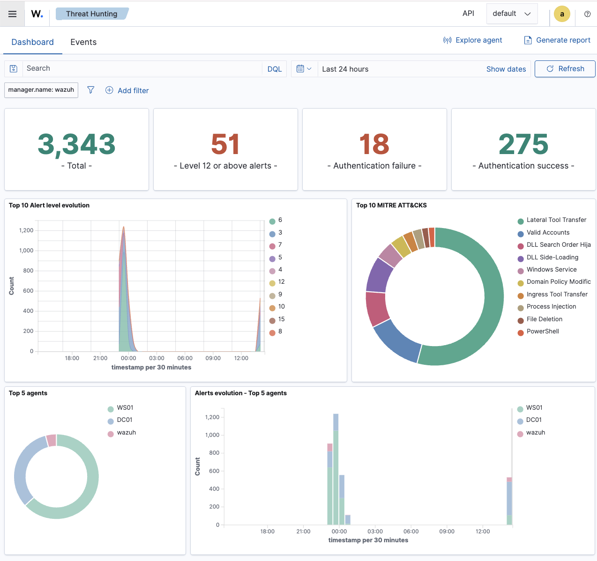

# Step 4 — Checking the whole thing actually works

Building the machines is one thing; proving that a security event on a Windows machine really turns
into an alert in the SIEM is the point of the whole lab. This step is that proof.

## What I checked

1. **Both agents are active** — in the Wazuh dashboard, DC01 and WS01 both show up and say "active".
2. **Windows logs are arriving** — filtering the dashboard by `agent.name: DC01` or `WS01` shows
   login and system events coming in.
3. **Sysmon logs are arriving** — filtering for
   `data.win.system.channel: "Microsoft-Windows-Sysmon/Operational"` shows detailed events like a
   program starting (event ID 1).
4. **A test attack is detected** — I typed a wrong password a few times on WS01 (a mini
   "someone's guessing the password" scenario). Each failed attempt is Windows event 4625, and each
   one showed up in Wazuh as an alert.
5. **DNS still fine** — `nslookup lab.local` from WS01 answers with DC01's address.
6. **The container stack is healthy** — `docker ps -a` across all three Compose projects
   (`wazuh-docker`, `docker/testing`, `pentest-lab`) shows every container `Up`, no restart loops,
   and `_cluster/health` on the indexer reports `"status":"green"`.
7. **The alert actually becomes a case, not just a dashboard entry** — this is the step the first
   four checks above don't cover on their own. The failed-logon alerts (rule `60122`, level 5) are
   deliberately *not* enough by themselves: `custom-w2thive.py`'s threshold only forwards level ≥ 6,
   so a single bad password never reaches TheHive — only the frequency-correlation rule (`60204`,
   "Multiple Windows Logon Failures", level 10, needs 8 failures inside 240s from the same source)
   does. Confirmed end-to-end after the Proxmox migration by re-running the brute-force replay with
   10 failed attempts: `60204` fired, `custom-w2thive` picked it up, and a real alert landed in
   TheHive (`docker exec <manager> tail /var/ossec/logs/integrations.log` shows `created TheHive
   alert: {...}`, cross-checked against TheHive's own API). See
   [docker-lab/05-hardware-migration.md](docker-lab/05-hardware-migration.md) for the two bugs that
   made this fail silently right after the migration (a missing `<integration>` block and a missing
   Python dependency) and how they were diagnosed.

## When I considered this step done

- The domain `lab.local` is up and WS01 is joined to it
- Wazuh is reachable and both agents are active
- Sysmon events are visible, and a deliberate wrong-password attempt appears as an alert
- The container stack is healthy (all `Up`, indexer `green`)
- The alert-to-case pipeline is proven, not assumed: a real TheHive alert exists for a real
  Wazuh alert, verified via the manager's integration log and TheHive's own API
- Screenshots taken (see the [checklist](assets/screenshots/README.md))

## How I write up an investigation

For anything worth showing, I use the same simple structure so it reads like a real analyst's note:

1. Goal — what I was testing and why
2. Environment — which machines, versions, IPs
3. Steps — what I actually did
4. What I observed — the events/fields
5. Triage — is this normal or suspicious, and what would I do about it
6. Why it matters for SOC work

The failed-logon investigation written this way is in
[incident-writeups/01-bruteforce.md](incident-writeups/01-bruteforce.md).

Next up: see [`PORTFOLIO_ROADMAP.md`](PORTFOLIO_ROADMAP.md) for what's planned — starting with the
rest of Phase 1 (GPO hardening, least privilege, file-server ACLs), then Kali against the domain in
Phase 2.
