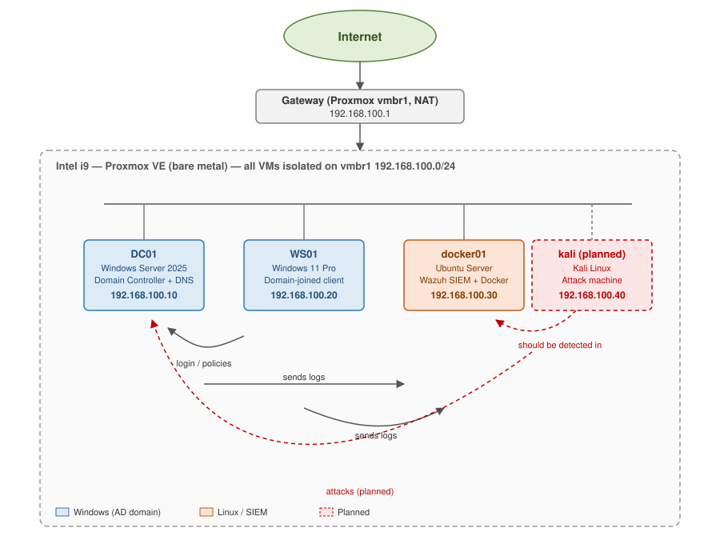

# SOC Homelab — Active Directory and Wazuh SIEM

This is a small security lab I built from scratch on my MacBook to learn the work of a
SOC (Security Operations Center) analyst. It runs a Windows domain, a Windows client that joins
that domain, and a Wazuh SIEM that collects the security logs from both machines. With that in
place I can generate real attacks later and watch them show up as alerts.

The idea is simple: instead of only collecting certificates, I want to show that I can actually
build the environment, produce real log data, and investigate it in a SIEM.

---

## What's in the lab

*Editable source: [assets/diagrams/network-diagram.drawio](assets/diagrams/network-diagram.drawio) (open with [diagrams.net](https://app.diagrams.net) / the draw.io desktop app).*

## The machines

| Role | Name | Operating system | IP address | RAM |
|---|---|---|---|---|
| Domain Controller | DC01 | Windows Server 2025 (ARM64) | 192.168.100.10 | 4 GB |
| Client | WS01 | Windows 11 Pro (ARM64) | 192.168.100.20 | 4 GB |
| SIEM | wazuh | Ubuntu Server (ARM64) | 192.168.100.30 | 4 GB |
| Attack machine (planned) | kali | Kali Linux (ARM64) | 192.168.100.40 | 2–3 GB |

- Domain name: `lab.local` · Network: `192.168.100.0/24` · Virtualization software: UTM
- My laptop is an Apple Silicon Mac (ARM), so every machine runs as an ARM64 virtual machine. That
  turned out to matter a lot, because a few things that are easy on a normal Intel PC needed
  workarounds here. I wrote all of those down in
  [99-troubleshooting.md](99-troubleshooting.md) so someone else (or future me) doesn't
  have to figure them out again.

## The full plan

This repo follows [`PORTFOLIO_ROADMAP.md`](PORTFOLIO_ROADMAP.md) — a much bigger, phased plan
covering Sysadmin, IAM, SIEM, networking, cloud, and hardening projects. What's below is just what's
actually built so far (Phase 0 and the start of Phase 1/2); the roadmap file has the full picture and
what's still open.

## Build log

Each step has its own page with the exact commands I ran and the problems I hit. Folders roughly
match the roadmap's phases: `ad-lab/` for on-prem Active Directory work, `siem-wazuh/` for the SIEM,
`incident-writeups/` for investigations.

| Step | What I did | Page | State |
|---|---|---|---|
| 0 | Get UTM and the install files ready | [00-lab-setup.md](00-lab-setup.md) | Done |
| 1.1 | Set up DC01, the domain controller | [ad-lab/01-domain-setup.md](ad-lab/01-domain-setup.md) | Done |
| 1.2 | Users, groups, and OUs | [ad-lab/02-users-and-groups.md](ad-lab/02-users-and-groups.md) | Done |
| 1.3 | Audit-logging group policy | [ad-lab/03-gpo-hardening.md](ad-lab/03-gpo-hardening.md) | Done |
| 1.4 | Set up WS01, join it to the domain, verify least privilege | [ad-lab/04-client-join-least-privilege.md](ad-lab/04-client-join-least-privilege.md) | Done |
| 1.5 | File-server ACLs | [ad-lab/05-fileserver-acls.md](ad-lab/05-fileserver-acls.md) | Done |
| 1.6 | Patching (WSUS) | see [PORTFOLIO_ROADMAP.md](PORTFOLIO_ROADMAP.md) | Skipped (not worth it for 2 machines) |
| 1.6b | Patch management, for real: updating Wazuh itself | [siem-wazuh/02-patch-management.md](siem-wazuh/02-patch-management.md) | Done |
| 1.7 | Harden the Wazuh Linux box (SSH, Fail2ban, UFW, services, auto-updates) | [linux-lab/01-ssh-hardening.md](linux-lab/01-ssh-hardening.md) | Done |
| 1.8–1.12 | Small networking labs (DHCP, DNS, troubleshooting, firewall ACLs, Wireshark) — doubles as Network+ practice | see [PORTFOLIO_ROADMAP.md](PORTFOLIO_ROADMAP.md) | Planned |
| 2.1, 2.5 | Install Wazuh, connect agents, add Sysmon | [siem-wazuh/01-wazuh-deployment.md](siem-wazuh/01-wazuh-deployment.md) | Done |
| — | Check that logs arrive and trigger a test alert | [04-validation.md](04-validation.md) | Done |
| 2.2 | Write-up: investigating a failed-logon alert | [incident-writeups/01-bruteforce.md](incident-writeups/01-bruteforce.md) | Done |
| Notes | Every problem I ran into and how I fixed it | [99-troubleshooting.md](99-troubleshooting.md) | Ongoing |

## What I learned to do here

- **Active Directory:** create a domain, run DNS, make users and groups, join a client
- **SIEM work:** install Wazuh, connect agents, add Sysmon, read events, investigate an alert
- **Windows admin:** set things up with PowerShell, fixed IP addresses, roles and features
- **Linux admin:** install Ubuntu Server, set the network, install software from the terminal
- **Virtualization and networking:** run several VMs on a Mac and get them to talk to each other
- **Writing it down:** clear step-by-step notes, a diagram, and one proper investigation write-up

## What's next

See [`PORTFOLIO_ROADMAP.md`](PORTFOLIO_ROADMAP.md) for the full, phased plan. Short version:

1. Core lab (this repo): domain controller, client, and Wazuh — done
2. Finish the rest of Phase 1 (file-server ACLs, Linux hardening on the Wazuh box, plus a handful of
   small networking-basics labs — DHCP, DNS internals, a troubleshooting exercise, Windows Firewall
   ACLs, Wireshark — that double as practice for CompTIA Network+) — planned
3. Attack the domain from Kali (Kerberoasting, Pass-the-Hash) and detect it in Wazuh — planned
4. Networking (pfSense/OPNsense, segmentation), then cloud IAM (Entra, Intune, Sentinel) — planned

---

*Built and documented by Jonas as part of a career change into security operations.*
