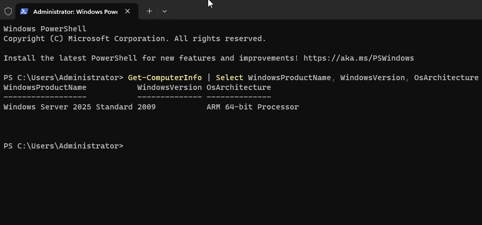
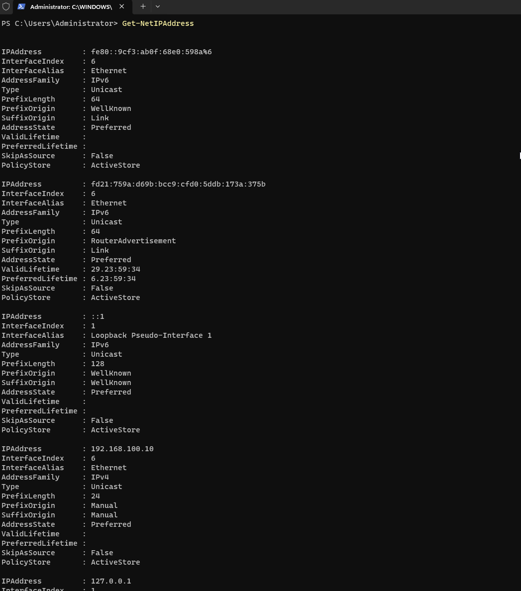
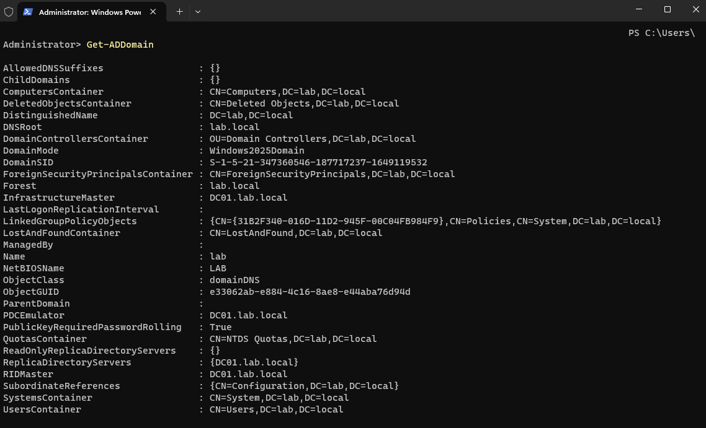
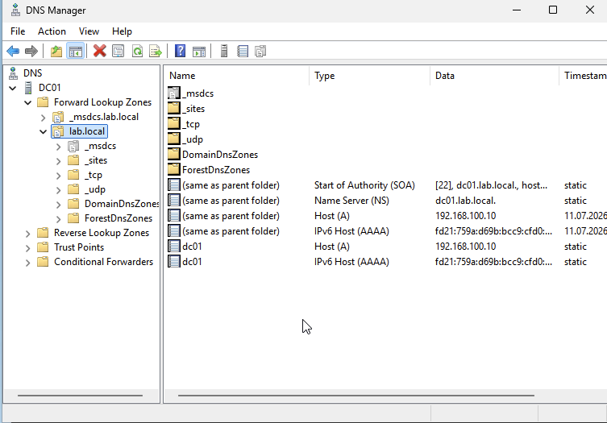
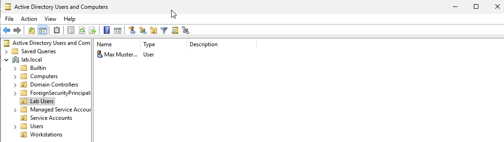
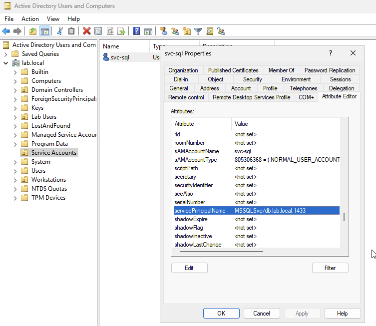

# Step 1 — DC01, the domain controller

The domain controller is the heart of a Windows network. It holds the user accounts, decides who is
allowed to log in, and runs DNS (the phone book that turns names like `dc01.lab.local` into IP
addresses). Everything else in the lab depends on it, so I built it first.

Goal for this step: a working domain called `lab.local` with DNS running on it.

## A note on the install file

Microsoft doesn't offer a normal ARM download of Windows Server, so I used an ARM preview build
(Windows Server 2025, build 26404) from a community mirror. I only run it in this isolated lab with
no real data on it, and I keep a note of exactly which build it is. I first tried the official Intel
version through emulation, but it was slow and the installer had a bug, so the ARM build was the
better choice here.

## 1. Create the virtual machine in UTM

- New VM → **Virtualize** → **Windows**, and pick the Server ARM64 ISO
- Make sure **"Use Apple Virtualization" is turned off** so it runs on the QEMU engine (this matters
  later so the machines can see each other on the network)
- 4 GB RAM, 2–4 CPU cores, 64 GB disk
- One network card, set to **Shared Network** with the values from
  [../00-lab-setup.md](../00-lab-setup.md)
- After the first boot, install the SPICE/guest tools (they fix the screen resolution and let you
  copy-paste)

## 2. First boot

Choose the edition **Standard (Desktop Experience)**, create a local admin account, and set a strong
password (I keep mine in my password manager).



## 3. Rename the machine and give it a fixed IP

Open **PowerShell as Administrator** and rename the machine:

```powershell
Rename-Computer -NewName DC01 -Restart
```

After it restarts, set the fixed IP address (check your network card's name first with
`Get-NetAdapter` — mine is called "Ethernet"):

```powershell
New-NetIPAddress -InterfaceAlias "Ethernet" -IPAddress 192.168.100.10 -PrefixLength 24 -DefaultGateway 192.168.100.15
Set-DnsClientServerAddress -InterfaceAlias "Ethernet" -ServerAddresses 127.0.0.1
```

The `127.0.0.1` means "use myself for DNS" — correct for a domain controller, because it *is* the
DNS server.



## 4. Turn it into a domain controller

Important thing I learned the hard way: run these commands in the **native ARM64 PowerShell**. On an
ARM machine Windows can also run a hidden "pretend-Intel" PowerShell, and if you're in that one this
step fails with a confusing error (`0x8007000B`, "incorrect format"). Check with:

```powershell
$env:PROCESSOR_ARCHITECTURE   # should say ARM64, not AMD64
```

If it says AMD64, close it and start `C:\Windows\System32\WindowsPowerShell\v1.0\powershell.exe` as
Administrator instead. The full story is in [../99-troubleshooting.md](../99-troubleshooting.md).

Then install the role and create the domain:

```powershell
Install-WindowsFeature AD-Domain-Services -IncludeManagementTools
Install-ADDSForest -DomainName "lab.local" -DomainNetbiosName "LAB" -InstallDns -Force
```

It asks for a recovery password, then reboots and comes back as a domain controller.

## 5. Check it worked

```powershell
Get-ADDomain
Get-Service ADWS,KDC,NTDS
nslookup lab.local
```

`nslookup lab.local` should answer with `192.168.100.10`.

## 6. Add some test accounts

I made a few organizational units (folders in AD) and some users. One of them, `svc-sql`, gets a
so-called SPN — that makes it a realistic target for an attack technique called Kerberoasting that I
want to try later.

```powershell
New-ADUser -Name "svc-sql" -SamAccountName "svc-sql" -AccountPassword (Read-Host -AsSecureString) -Enabled $true
setspn -S MSSQLSvc/db.lab.local:1433 LAB\svc-sql
```








