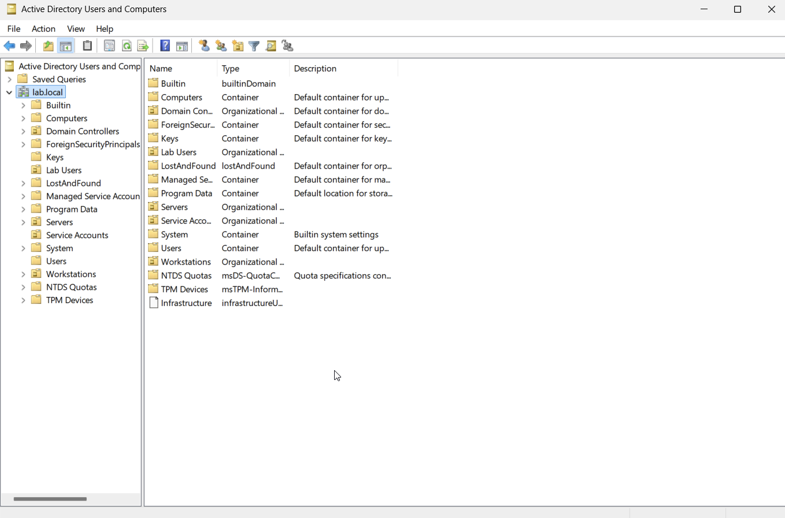
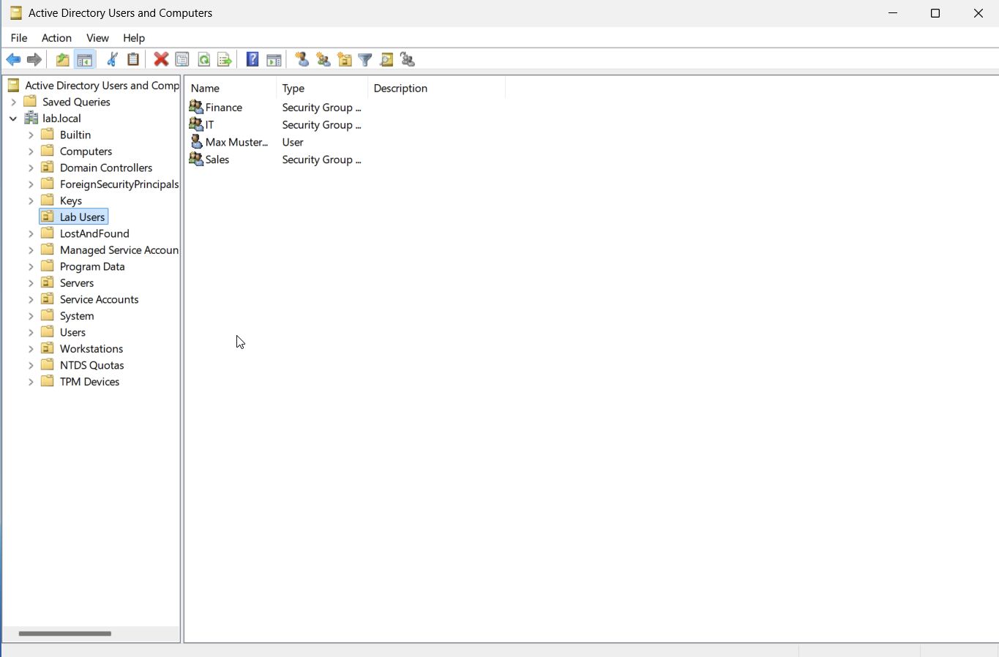
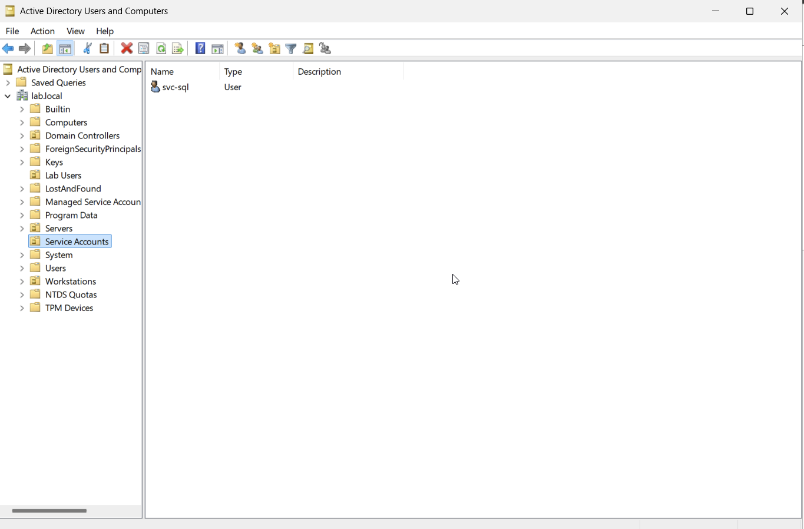
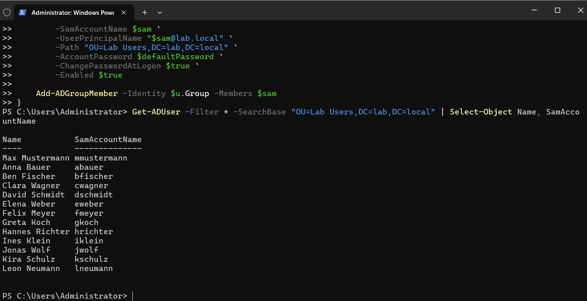

# Step 1.2 — Users, groups, and OUs

Goal for this step: a realistic org structure instead of just a couple of throwaway test accounts —
organizational units by purpose, a few department groups, and a batch of test users spread across
them.

## The OU structure

These four OUs already existed from the very first AD setup (see
[`01-domain-setup.md`](01-domain-setup.md)):

```
lab.local
├── Lab Users        (test users live here)
├── Workstations      (WS01 belongs here)
├── Servers            (for future server VMs)
└── Service Accounts  (svc-sql lives here)
```



## Department groups

Three security groups, one per department, so later permission scenarios (like the file-server ACLs
in step 1.5) have something realistic to work with:

```powershell
New-ADGroup -Name "IT" -GroupScope Global -GroupCategory Security -Path "OU=Lab Users,DC=lab,DC=local"
New-ADGroup -Name "Sales" -GroupScope Global -GroupCategory Security -Path "OU=Lab Users,DC=lab,DC=local"
New-ADGroup -Name "Finance" -GroupScope Global -GroupCategory Security -Path "OU=Lab Users,DC=lab,DC=local"
```



## svc-sql already lives in the right place

I checked before moving it, and `svc-sql` was already sitting in `Service Accounts` from the initial
setup — no move needed.

```powershell
Get-ADUser svc-sql -Properties DistinguishedName | Select-Object DistinguishedName
# CN=svc-sql,OU=Service Accounts,DC=lab,DC=local
```



## Cleaning up an old test account

`mmustermann` — the account I used for the failed-logon testing back in
[`incident-writeups/01-bruteforce.md`](../incident-writeups/01-bruteforce.md) — was still sitting in
the default `CN=Users` container instead of a proper OU, left over from before this OU structure
existed. Moved it into `Lab Users` to keep things consistent:

```powershell
Get-ADUser mmustermann -Properties DistinguishedName | Select-Object DistinguishedName
# was: CN=mmustermann,CN=Users,DC=lab,DC=local

Move-ADObject -Identity (Get-ADUser mmustermann).DistinguishedName -TargetPath "OU=Lab Users,DC=lab,DC=local"
```

## Twelve test users, created with a script

Rather than clicking through "New User" a dozen times, I wrote a small PowerShell script that creates
a batch of users and adds each one to its department group in one pass. It's in
[`scripts/create-users.ps1`](scripts/create-users.ps1):

```powershell
$users = @(
    @{First="Anna";   Last="Bauer";     Group="IT"}
    @{First="Ben";    Last="Fischer";   Group="IT"}
    @{First="Clara";  Last="Wagner";    Group="IT"}
    @{First="David";  Last="Schmidt";   Group="Sales"}
    @{First="Elena";  Last="Weber";     Group="Sales"}
    @{First="Felix";  Last="Meyer";     Group="Sales"}
    @{First="Greta";  Last="Koch";      Group="Sales"}
    @{First="Hannes"; Last="Richter";   Group="Finance"}
    @{First="Ines";   Last="Klein";     Group="Finance"}
    @{First="Jonas";  Last="Wolf";      Group="Finance"}
    @{First="Kira";   Last="Schulz";    Group="IT"}
    @{First="Leon";   Last="Neumann";   Group="Sales"}
)

$defaultPassword = ConvertTo-SecureString "Passw0rd!ChangeMe" -AsPlainText -Force

foreach ($u in $users) {
    $sam = ($u.First.Substring(0,1) + $u.Last).ToLower()

    New-ADUser `
        -Name "$($u.First) $($u.Last)" `
        -GivenName $u.First `
        -Surname $u.Last `
        -SamAccountName $sam `
        -UserPrincipalName "$sam@lab.local" `
        -Path "OU=Lab Users,DC=lab,DC=local" `
        -AccountPassword $defaultPassword `
        -ChangePasswordAtLogon $true `
        -Enabled $true

    Add-ADGroupMember -Identity $u.Group -Members $sam
}
```

A couple of notes on the script:

- The password is a simple lab-only placeholder. `ChangePasswordAtLogon` forces each account to set
  its own password on first login, so the placeholder itself is never actually used to sign in.
- 12 users split across the three department groups — enough to make group-membership-based scenarios
  later (like a rogue admin add in roadmap item 2.3) realistic, without hand-typing each one.

Checked the result:

```powershell
Get-ADUser -Filter * -SearchBase "OU=Lab Users,DC=lab,DC=local" | Select-Object Name, SamAccountName
```



## Why this matters for SOC work

Understanding group membership is central to spotting privilege escalation — you can't tell that
something is *wrong* (a user suddenly in Domain Admins, a service account added to a sensitive group)
if you don't already know what *normal* group membership looks like. Building this structure by hand
is what makes that baseline real instead of theoretical.
