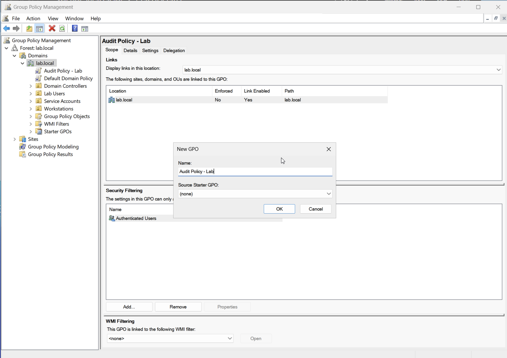
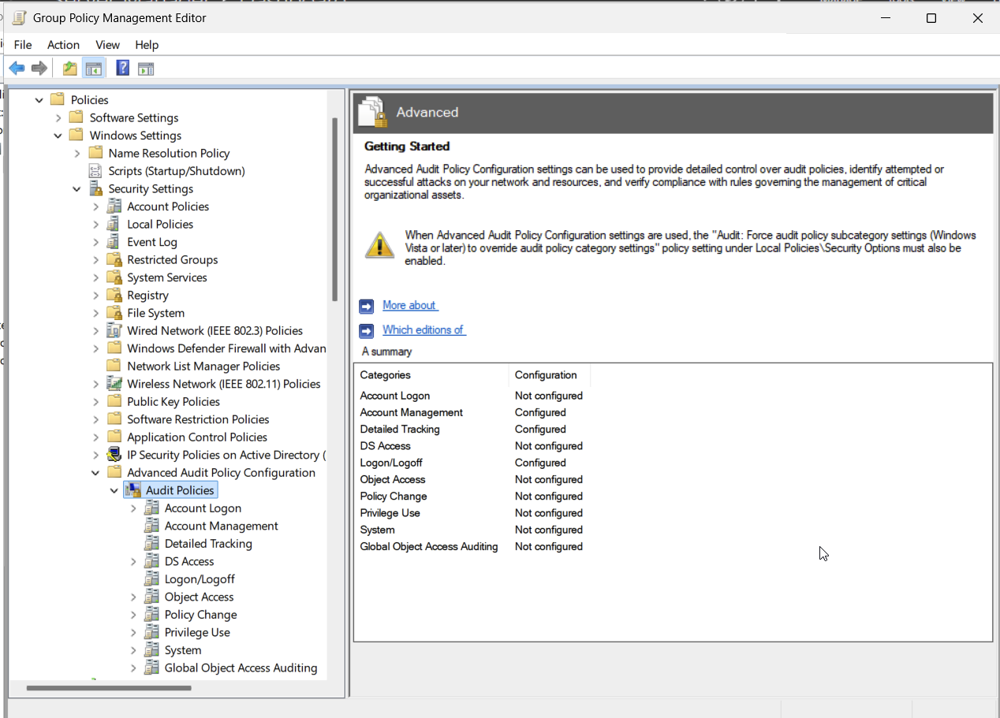
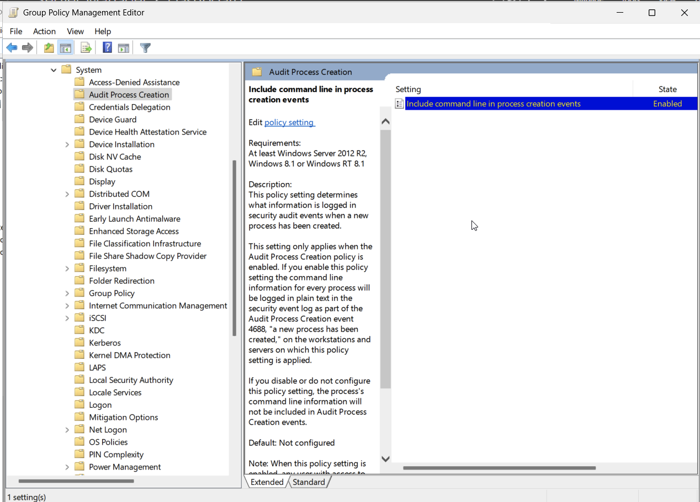
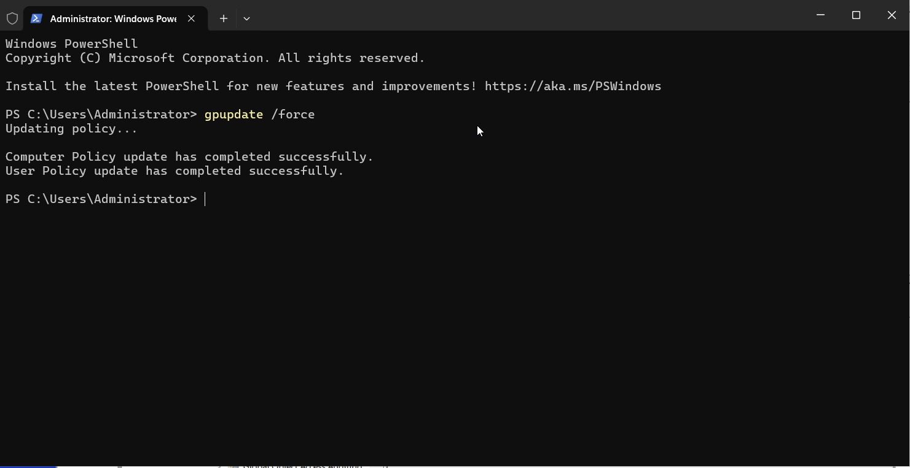
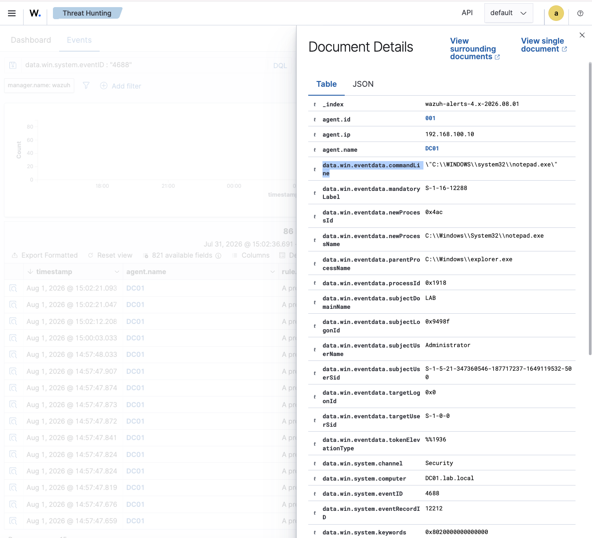
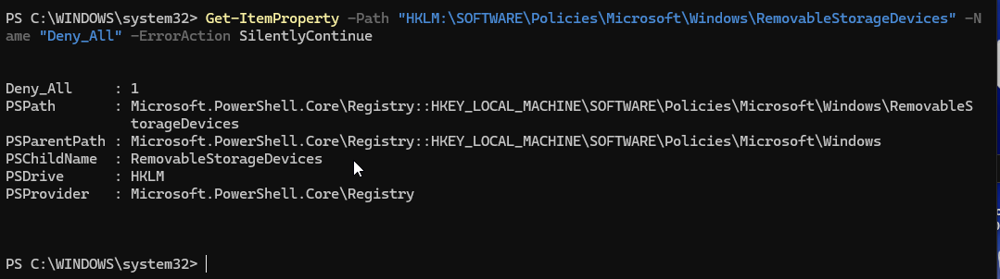
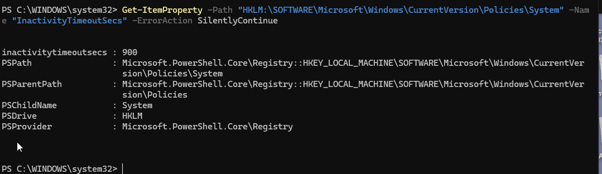
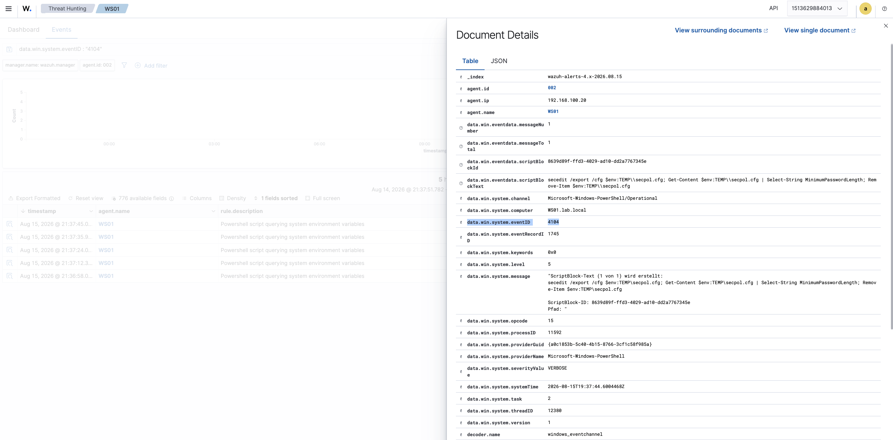
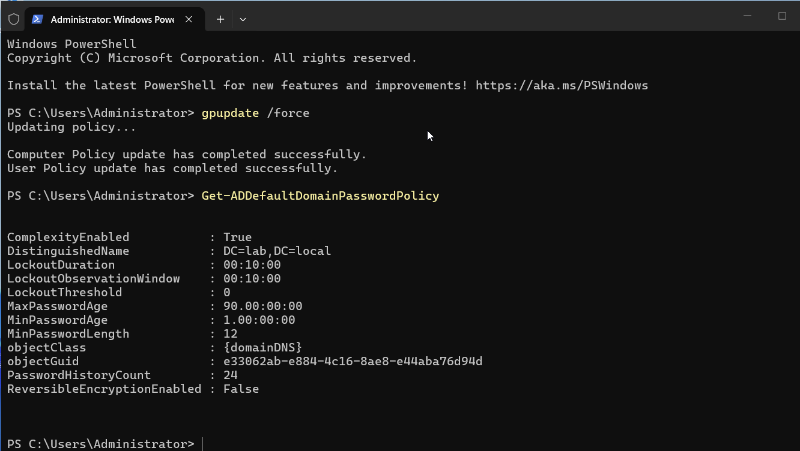

# Step 1.3 — Group policies: audit logging

Goal for this step: turn on more detailed Windows auditing through a group policy, so Wazuh has much
more to work with. By default, a Windows domain logs very little. Things like "a process started" or
"someone changed a user account" aren't logged at all unless you turn on the right audit categories.

This is also a prerequisite for later detection work (like catching Kerberoasting or a rogue admin
account being created) — those attacks are only visible if the right events are being logged in the
first place.

## What I turned on

I created one GPO (`Audit Policy - Lab`) linked to the domain, with these settings:

- **Advanced Audit Policy Configuration → Logon/Logoff → Logon** (Success and Failure) — a more
  detailed version of the normal 4624/4625 login events.
- **Advanced Audit Policy Configuration → Account Management → User Account Management** (Success and
  Failure) — logs when accounts are created, changed, or added to groups. This is what will let me
  catch a rogue admin account being created later.
- **Advanced Audit Policy Configuration → Detailed Tracking → Process Creation** (Success and
  Failure) — Windows event 4688, logged every time a process starts. This is one of the most useful
  events for a SOC analyst.
- **Administrative Templates → System → Audit Process Creation → Include command line in process
  creation events** — without this, event 4688 tells you a process started but not what arguments it
  was run with. Turning this on makes the event actually useful (you can see, for example, that
  `powershell.exe` was run with a suspicious encoded command).

## Screenshots







## Verifying it worked

```powershell
gpupdate /force
```

on DC01 and WS01.



Then checked that new events actually started arriving in Wazuh:

```
data.win.system.eventID : "4688"
```



## USB storage blocking

Set through the registry-based policy path (`Removable Storage Access` →
`RemovableStorageDevices\Deny_All`) rather than clicking through every individual device class —
one setting denies read and write access to removable storage across the board.

```powershell
Get-ItemProperty "HKLM:\SOFTWARE\Policies\Microsoft\Windows\RemovableStorageDevices" -Name "Deny_All"
```



Tested it live by plugging a USB stick into WS01 after the policy applied — Windows Explorer never
showed the drive at all, rather than showing it and then denying access, which is the expected
behavior for a full deny-all policy.

## Screen lock on inactivity

Configured under **Security Settings → Local Policies → Security Options → Interactive logon:
Machine inactivity limit**, which Windows implements underneath as the `InactivityTimeoutSecs`
registry value — set to 900 seconds (15 minutes).

```powershell
Get-ItemProperty "HKLM:\SOFTWARE\Microsoft\Windows\CurrentVersion\Policies\System" -Name "InactivityTimeoutSecs"
```



Left the session idle past the timeout and confirmed the lock screen actually appeared, not just the
registry value being set — a policy that's configured but never verified against real behavior isn't
actually verified.

## PowerShell Script Block Logging

Enabled under **Administrative Templates → Windows Components → Windows PowerShell → Turn on
PowerShell Script Block Logging**. This logs the actual content of PowerShell commands and scripts as
they execute (Windows event 4104) — one of the highest-value log sources for catching obfuscated or
encoded PowerShell, which plain command-line logging (from the process-creation auditing above) can
miss if the interesting part only shows up once PowerShell decodes it internally.

Confirmed the setting applied on WS01:

```powershell
Get-ItemProperty "HKLM:\SOFTWARE\Policies\Microsoft\Windows\PowerShell\ScriptBlockLogging" -Name "EnableScriptBlockLogging"
```

But the first real test — running a PowerShell command on WS01 and checking Wazuh for the resulting
4104 event — came back empty. Wazuh's Windows agent doesn't monitor the
`Microsoft-Windows-PowerShell/Operational` event channel by default; process-creation events and
PowerShell script-block events are forwarded through separate, individually configured log sources.
Fixed by adding that channel explicitly to the **WS01 agent's own** `ossec.conf`
(`C:\Program Files (x86)\ossec-agent\ossec.conf`, not the manager's):

```xml
<localfile>
  <location>Microsoft-Windows-PowerShell/Operational</location>
  <log_format>eventchannel</log_format>
</localfile>
```

```powershell
Restart-Service -Name WazuhSvc
```

After the restart, running a PowerShell command on WS01 produced a real 4104 event in Wazuh:



Worth remembering generally: a GPO applying successfully on the client doesn't automatically mean the
resulting events reach the SIEM — the agent's own log-source configuration is a separate step, easy
to assume is "included" when it isn't.

## Password policy

Verified the domain's default password policy (this is a fine-grained-password-policy-free lab, so
the Default Domain Policy is what actually governs domain accounts):

```powershell
Get-ADDefaultDomainPasswordPolicy
```



Complexity required, 12-character minimum, 90-day max age, 24-password history — reasonable, roughly
CIS-benchmark-level defaults for a lab domain. One deliberate exception: `LockoutThreshold` is `0`
(disabled) rather than the CIS-recommended small number. That's a conscious lab-only choice, not an
oversight — leaving lockout off makes it possible to run repeated brute-force tests against a domain
account (see `incident-writeups/01-bruteforce.md` and `docker-lab/04-thehive-cortex.md`) without the
account locking itself out mid-test. In a real environment I would absolutely turn this back on; here,
it trades a real-world control for the ability to reliably generate the exact traffic I'm trying to
detect.

## Why this matters for SOC work

Process-creation logging (with command lines) is one of the highest-value log sources for a SOC —
it's how you catch things like a script running from an unusual path, an encoded PowerShell command,
or a suspicious tool being launched. This maps to MITRE ATT&CK T1059 (Command and Scripting
Interpreter) and is the foundation for a lot of endpoint detection rules.

The account-management auditing is what will let me build the "rogue admin account" detection later
(roadmap item 2.3) — without it, that kind of change wouldn't show up at all.

The rest of this GPO set maps to standard endpoint-hardening controls a SOC expects to see in place:
USB blocking limits a classic data-exfiltration and malware-introduction path (T1052 for the USB
side, T1091 for the "removable media" ATT&CK technique in general), inactivity lock reduces the
window an unattended, already-authenticated session is exposed, PowerShell Script Block Logging is
one of the single best log sources for catching living-off-the-land attacks that plain command-line
logging can miss, and a documented password policy — including consciously chosen exceptions and why
— is the kind of judgment call a real environment needs explained, not just configured.
