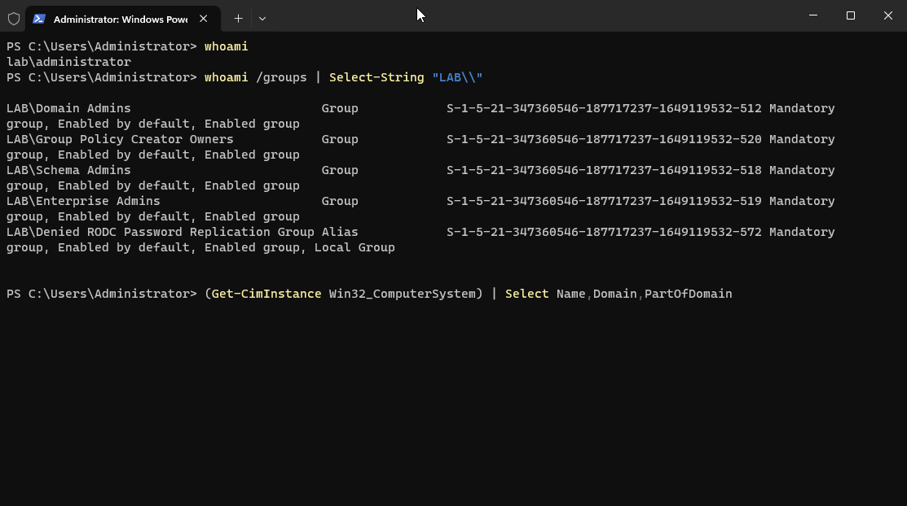
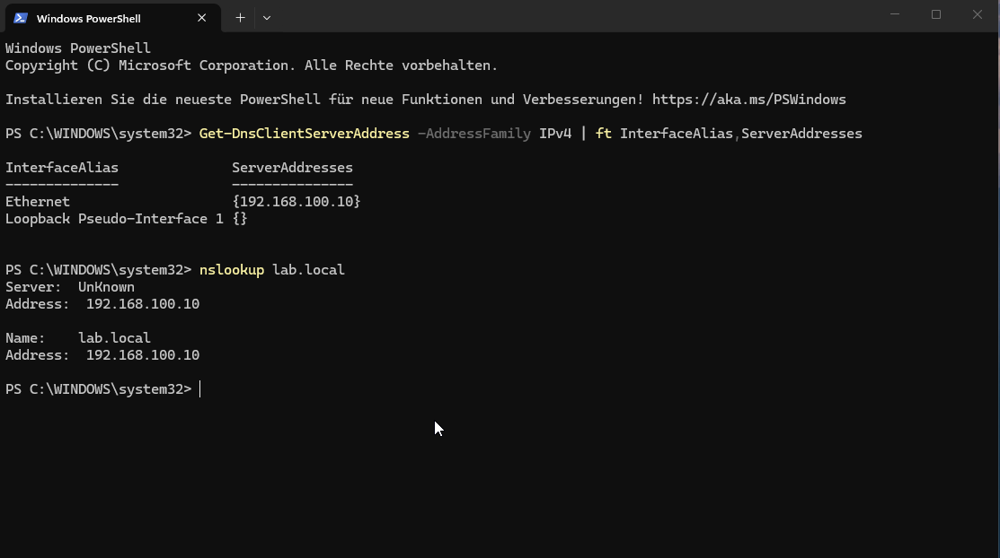
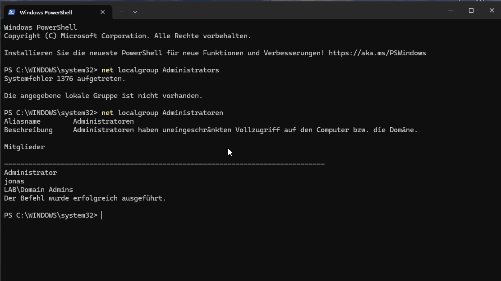
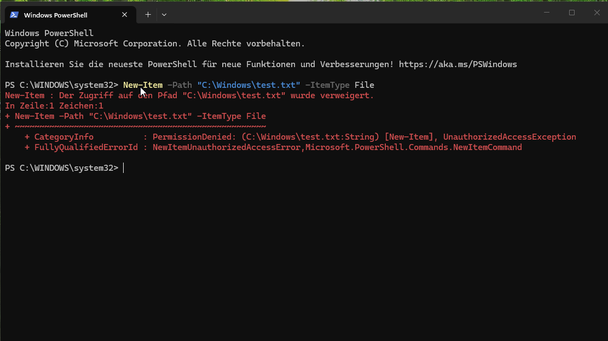

# Step 2 — WS01, the Windows client, and joining the domain

WS01 is a normal Windows 11 machine that acts like an employee's computer. Joining it to the domain
means it now trusts DC01 for logins, and — more importantly for this lab — it becomes a source of
security logs that Wazuh can collect.

One thing to know up front: it has to be **Windows 11 Pro**. The Home edition simply can't join a
domain.


## 1. Create the virtual machine in UTM

- New VM → **Virtualize** → **Windows**, pick the Windows 11 ARM64 ISO
- **"Use Apple Virtualization" turned off** (QEMU engine), one network card on **Shared Network**
  with the values from [../00-lab-setup.md](../00-lab-setup.md)
- 4 GB RAM, 64 GB disk; install the guest tools after the first boot

## 2. Windows setup

- Choose the **Pro** edition.
- Windows 11 tries to force you to sign in with a Microsoft account. To create a plain local account
  instead, press `Shift+F10` at the network screen to open a command prompt and run
  `start ms-cxh:localonly` (on some builds the older `OOBE\BYPASSNRO` works). Then make a local
  account.


## 3. Fixed IP, and point DNS at the domain controller

Open **PowerShell as Administrator**:

```powershell
New-NetIPAddress -InterfaceAlias "Ethernet" -IPAddress 192.168.100.20 -PrefixLength 24 -DefaultGateway 192.168.100.15
Set-DnsClientServerAddress -InterfaceAlias "Ethernet" -ServerAddresses 192.168.100.10
```

This is the key part: the client's DNS server must be **DC01 (192.168.100.10)**. If it points
anywhere else, joining the domain fails, because the machine can't find the domain. Check it with:

```powershell
nslookup lab.local   # must answer 192.168.100.10
```

(If `nslookup` shows a weird `fe80::...` address and times out, that's an IPv6 issue I ran into —
the fix is in [../99-troubleshooting.md](../99-troubleshooting.md).)

## 4. Join the domain

```powershell
Add-Computer -DomainName "lab.local" -Restart
```

Log in as `LAB\Administrator` when it asks.

## 5. Check it worked

- After the restart, sign in with a domain account (`LAB\<user>`).
- On DC01, `Get-ADComputer WS01` should now list the machine.





## 6. Least privilege — checking domain users aren't local admins

Joining WS01 to the domain doesn't automatically make every domain user an admin on it — but it's
worth actually checking that, instead of assuming it. Because Windows on this VM isn't in English,
`net localgroup Administrators` fails with "system error 1376" (the group name is localized). Using
the well-known SID sidesteps that:

```powershell
Get-LocalGroupMember -SID "S-1-5-32-544"
# or, using the German group name directly:
net localgroup Administratoren
```



None of the test users from [`02-users-and-groups.md`](02-users-and-groups.md) (like `abauer`) show
up here, so they're standard, non-privileged accounts on WS01 by default.

To prove that actually holds up, I signed in as `LAB\abauer` and tried something that needs admin
rights — writing a file into `C:\Windows`:

```powershell
New-Item -Path "C:\Windows\test.txt" -ItemType File
```



Denied, as expected. Least privilege for standard domain users on WS01 is confirmed, not just
assumed.
