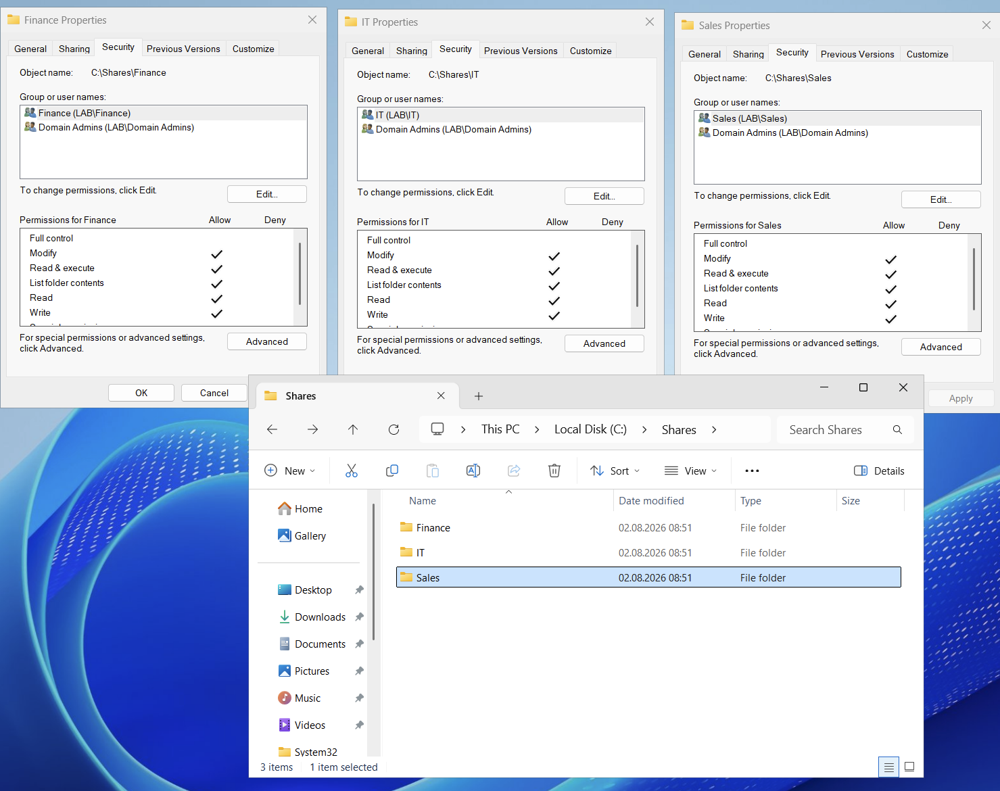
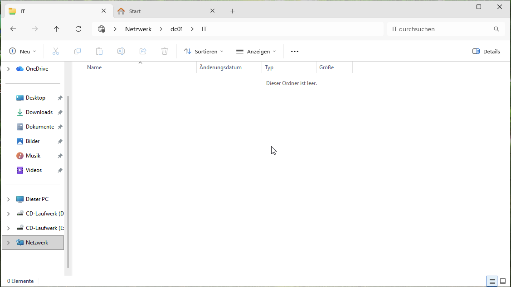
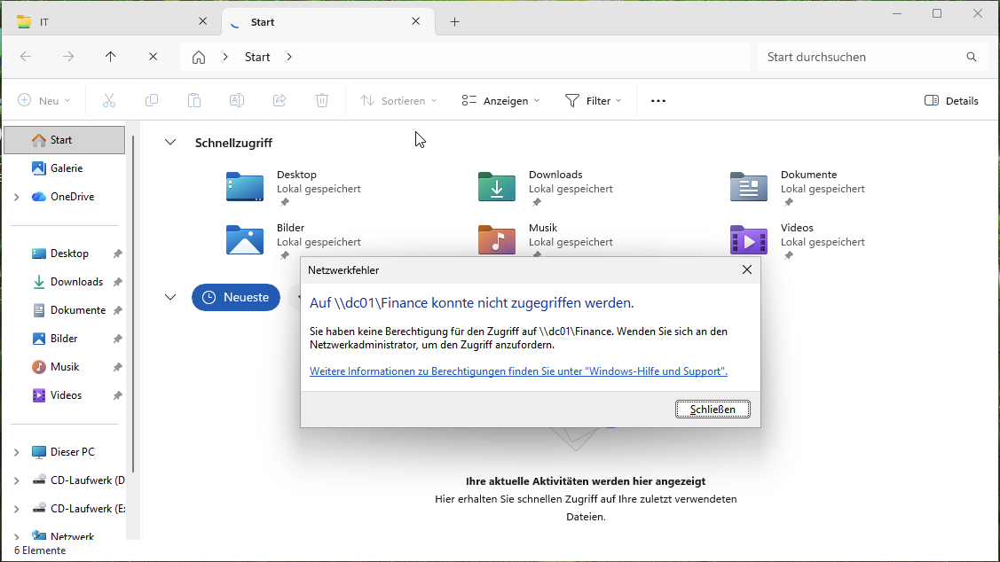

# Step 1.5 — File server and NTFS permissions

Goal for this step: department shares where only the right group can get in — and actually
understanding the difference between share permissions and NTFS permissions, not just clicking
through a wizard.

DC01 doubles as the file server here; a dedicated file server VM wasn't worth it for three small
shares.

## The two layers of permissions

A network share on Windows is protected by two separate permission systems at the same time:

- **Share permissions** — control access only when someone connects over the network (`\\dc01\IT`).
- **NTFS permissions** — control access to the actual files and folders on disk, both locally and
  over the network.

When both apply, the *more restrictive* one wins. The common (and recommended) approach is to leave
the share permission wide open (`Everyone: Full Control`) and do all the real restricting with NTFS
permissions. That way there's only one place to manage access, instead of having to keep two
permission systems in sync.

## 1. Folder structure

```powershell
New-Item -Path "C:\Shares\IT" -ItemType Directory
New-Item -Path "C:\Shares\Sales" -ItemType Directory
New-Item -Path "C:\Shares\Finance" -ItemType Directory
```

## 2. Share them (deliberately wide open)

```powershell
New-SmbShare -Name "IT" -Path "C:\Shares\IT" -FullAccess "Everyone"
New-SmbShare -Name "Sales" -Path "C:\Shares\Sales" -FullAccess "Everyone"
New-SmbShare -Name "Finance" -Path "C:\Shares\Finance" -FullAccess "Everyone"
```

## 3. NTFS permissions — where the real restriction happens

For each folder: turn off permission inheritance (so it stops copying whatever the parent folder
allows), then only add the matching department group and Domain Admins.

```powershell
foreach ($dept in "IT","Sales","Finance") {
    $path = "C:\Shares\$dept"
    $acl = Get-Acl $path
    $acl.SetAccessRuleProtection($true, $false)   # inheritance off, don't keep existing rules

    $deptRule = New-Object System.Security.AccessControl.FileSystemAccessRule("LAB\$dept","Modify","ContainerInherit,ObjectInherit","None","Allow")
    $adminRule = New-Object System.Security.AccessControl.FileSystemAccessRule("LAB\Domain Admins","FullControl","ContainerInherit,ObjectInherit","None","Allow")

    $acl.AddAccessRule($deptRule)
    $acl.AddAccessRule($adminRule)
    Set-Acl $path $acl
}
```

Checked the result:

```powershell
Get-Acl "C:\Shares\IT" | Format-List
```



## 4. Testing it for real

Logged into WS01 as `abauer` (member of the `IT` group, from
[`02-users-and-groups.md`](02-users-and-groups.md)) and tried both shares.

`\\dc01\IT` — allowed:



`\\dc01\Finance` — denied:



Exactly what I'd expect: a member of `IT` can get into the `IT` share because of the NTFS rule, and
is blocked from `Finance` because there's no rule granting her access there at all — the wide-open
share permission never even comes into play.

## Why this matters for SOC work

Ransomware and data-theft cases almost always come down to "what could this account actually reach,"
and that's an NTFS-permissions question, not a share-permissions question. Knowing that the share
layer is usually left open and NTFS does the real work means I know where to actually look when
investigating unauthorized file access — checking share permissions alone would give a false sense of
security.
