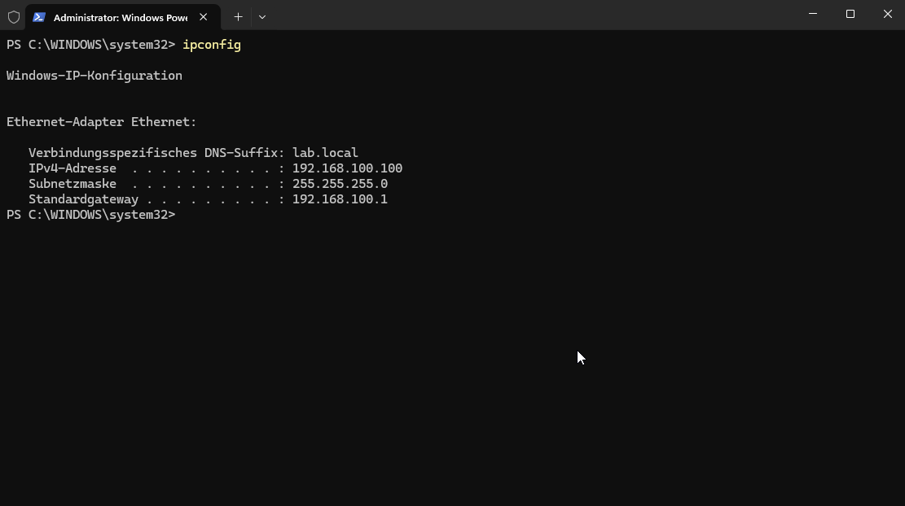
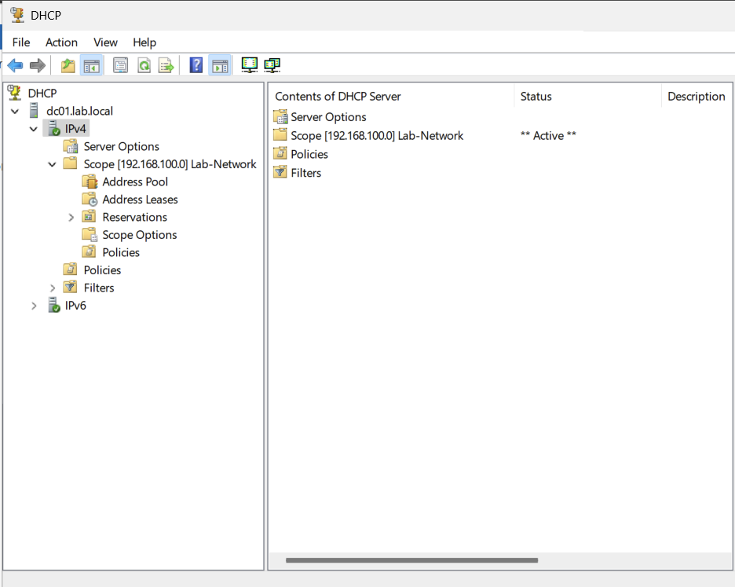

# DHCP on DC01

Up to now, every machine in the lab (DC01, WS01, the Wazuh box) has had a fixed IP address set by
hand. That's fine for a handful of core machines, but it doesn't scale, and it's not how most real
networks work — even environments that rely on static addressing for servers still run DHCP for
everything else. This step adds a DHCP scope on DC01 for anything that comes and goes later (the
planned Kali VM, ad-hoc test clients), while deliberately keeping the existing core machines on
their current fixed IPs rather than converting them to DHCP reservations.

## Why not just put everything on DHCP reservations?

I considered giving DC01, WS01, and the Wazuh box DHCP reservations instead of the manually
configured static IPs they already have. In the end I kept the static configuration for those
three, for the same reason real networks usually do it this way: core infrastructure — domain
controllers, the SIEM, printers, anything other systems depend on having a predictable address for
— tends to be either statically configured or excluded from the DHCP pool entirely, while
everything more transient (workstations, guests, anything that just needs "an IP, any IP, right
now") gets a dynamic lease from the pool. Switching the three existing machines to DHCP would also
add a new dependency that wasn't there before: WS01's network config would suddenly depend on DC01's
DHCP service being up, on top of the DNS/AD dependency it already has.

## Installing the DHCP role

On DC01, PowerShell as Administrator:

```powershell
Install-WindowsFeature -Name DHCP -IncludeManagementTools
```

A DHCP server in a domain has to be explicitly authorized in Active Directory before it will hand
out any leases — this is a safeguard against a rogue or misconfigured DHCP server on the network
handing out bad addresses:

```powershell
Add-DhcpServerInDC -DnsName "dc01.lab.local" -IPAddress 192.168.100.10
```

## Creating the scope

The scope covers `192.168.100.100`–`192.168.100.200` — deliberately separate from the range already
used by the three fixed-IP machines (`.10`, `.20`, `.30`), so there's no risk of an address
conflict:

```powershell
Add-DhcpServerv4Scope -Name "Lab-Network" -StartRange 192.168.100.100 -EndRange 192.168.100.200 -SubnetMask 255.255.255.0 -State Active
```

Gateway and DNS server for anything that picks up a lease:

```powershell
Set-DhcpServerv4OptionValue -ScopeId 192.168.100.0 -Router 192.168.100.1 -DnsServer 192.168.100.10 -DnsDomain "lab.local"
```



## Testing it with WS01

To actually see a lease being handed out, I temporarily switched WS01 from its fixed IP to
"obtain an IP address automatically":

```powershell
Set-NetIPInterface -InterfaceAlias "Ethernet" -Dhcp Enabled
Remove-NetIPAddress -InterfaceAlias "Ethernet" -Confirm:$false
ipconfig /renew
```

WS01 picked up an address from the `.100`–`.200` range, which showed up as an active lease in the
DHCP console:



Afterward, switched WS01 back to its normal fixed configuration:

```powershell
Set-NetIPInterface -InterfaceAlias "Ethernet" -Dhcp Disabled
New-NetIPAddress -InterfaceAlias "Ethernet" -IPAddress 192.168.100.20 -PrefixLength 24 -DefaultGateway 192.168.100.1
Set-DnsClientServerAddress -InterfaceAlias "Ethernet" -ServerAddresses 192.168.100.10
```

## Why this matters for SOC work

DHCP logs are a common way to tie an IP address back to a specific device at a specific point in
time during an investigation — an alert that only has a source IP is much less useful without a way
to figure out which machine actually had that address when the alert fired. Understanding scopes,
leases, and reservations is also plain Network+ material (the DNS/DHCP domain), and knowing when
*not* to put something on DHCP — core infrastructure that other systems depend on — is as much a
part of that knowledge as knowing how to set up a scope in the first place.
