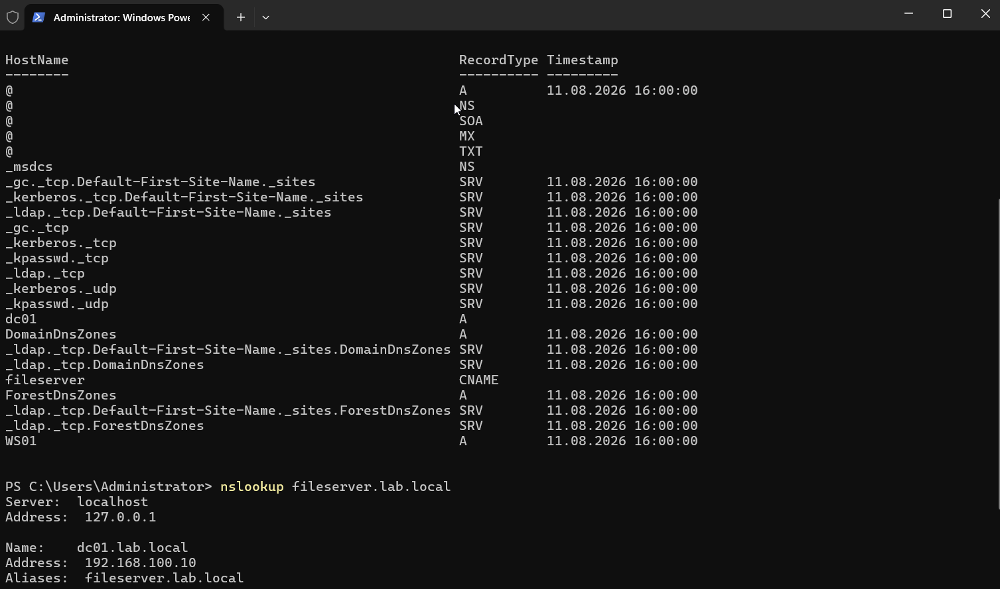
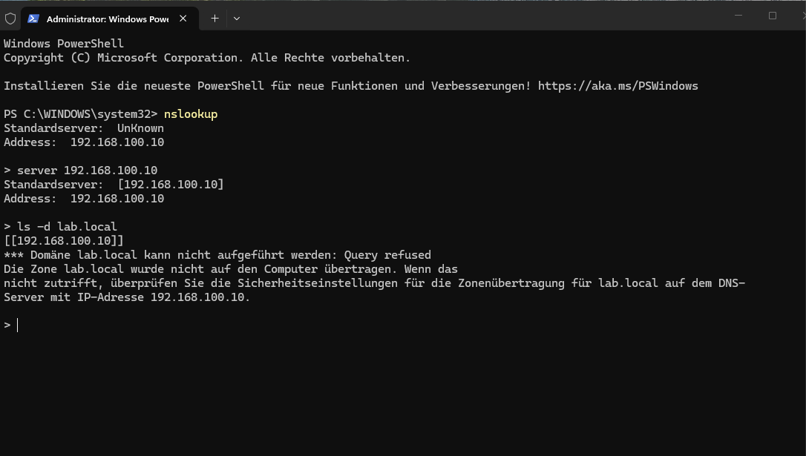
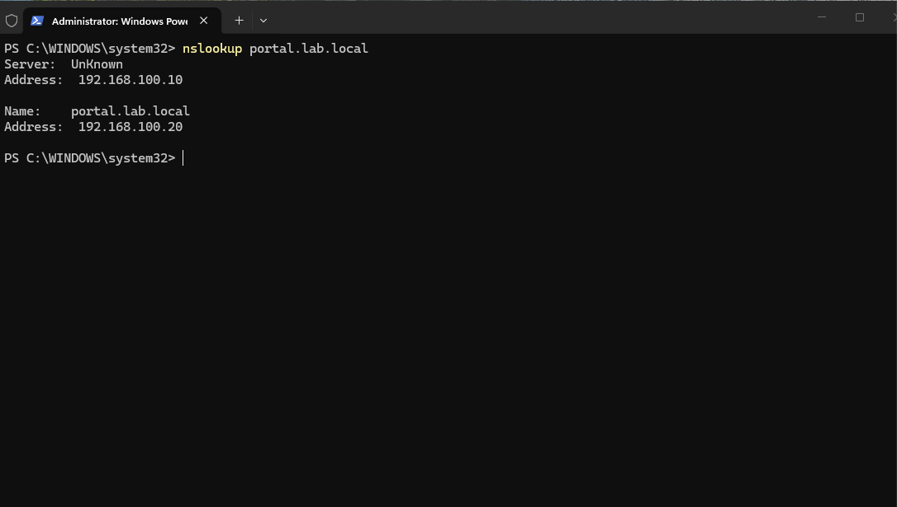

# DNS beyond the basics

DC01 has been running DNS since the very first step of this lab (`ad-lab/01-domain-setup.md`), but
so far only in the "it resolves names" sense. This step goes a level deeper: what record types
exist and what they're actually for, why zone transfers need to be restricted, and what split-
horizon DNS is and how Windows Server can do it.

## Record types

Active Directory automatically creates a lot of DNS records on its own — mostly SRV records that
let domain-joined machines find domain controllers and other AD services:

```powershell
Get-DnsServerResourceRecord -ZoneName lab.local | Format-Table HostName, RecordType, Timestamp
```

To see the other common record types in practice, I added a few by hand:

```powershell
Add-DnsServerResourceRecordCName -ZoneName lab.local -Name "fileserver" -HostNameAlias "dc01.lab.local"
Add-DnsServerResourceRecordMX -ZoneName lab.local -Name "@" -MailExchange "dc01.lab.local" -Preference 10
Add-DnsServerResourceRecord -ZoneName lab.local -Txt -Name "@" -DescriptiveText "v=spf1 -all"
```

- **CNAME** — an alias for another name. `fileserver.lab.local` now just points at `dc01.lab.local`
  rather than needing its own A record kept in sync separately.
- **MX** — where mail for the domain should go. There's no real mail server here, but this is how
  every domain announces its mail servers, at a specific priority.
- **TXT** — arbitrary text attached to a name. Widely used for domain verification and for SPF
  records (`v=spf1 -all` here means "no server is authorized to send mail as this domain" — a
  reasonable default for a domain that doesn't actually send mail).

Confirmed the CNAME resolves correctly:

```powershell
nslookup fileserver.lab.local
```



## Zone transfers

A zone transfer is a bulk export of every record in a DNS zone in one request — meant for
legitimate secondary DNS servers to replicate a primary zone, but a goldmine for an attacker doing
reconnaissance if it's left open to anyone who asks: one query, and they have every hostname, IP,
and service in the domain instead of guessing.

```powershell
Get-DnsServerZone -Name lab.local | Select-Object ZoneName, ZoneType, SecureSecondaries
```

`SecureSecondaries` was already set to only allow transfers to servers listed in the zone's own NS
records — which in this lab means, in practice, nobody, since there's only the one DNS server.
Tested it directly rather than trusting the setting alone, from WS01:

```
nslookup
> server 192.168.100.10
> ls -d lab.local
```

The request was refused, confirming the zone is not open to transfer.



## Split-horizon DNS

Split-horizon (or "split-brain") DNS means the same hostname resolves to a different answer
depending on where the query comes from — typically an internal IP for clients inside the corporate
network, and a public IP for anyone on the internet. It's common for things like an internal portal
that also needs to be reachable from outside (e.g. over VPN or from a branch office), under one
consistent name.

Testing this properly needs a real client sitting outside the network to compare against — which
this lab doesn't have yet — but Windows Server DNS has a built-in feature for exactly this
scenario, DNS Policies with zone scopes, and I could at least verify the internal half of it.

Created two "views" of the same name, `portal.lab.local`:

```powershell
Add-DnsServerZoneScope -ZoneName lab.local -Name "InternalScope"
Add-DnsServerZoneScope -ZoneName lab.local -Name "ExternalScope"

Add-DnsServerResourceRecord -ZoneName lab.local -A -Name "portal" -IPv4Address 192.168.100.20 -ZoneScope "InternalScope"
Add-DnsServerResourceRecord -ZoneName lab.local -A -Name "portal" -IPv4Address 203.0.113.50 -ZoneScope "ExternalScope"
```

(`203.0.113.50` is an RFC 5737 documentation address — standing in for "a public IP", not something
actually reachable, just to make the two answers clearly distinct.)

Defined which client subnets map to which scope — the lab network counts as "internal", everything
else falls through to "external":

```powershell
Add-DnsServerClientSubnet -Name "InternalSubnet" -IPv4Subnet "192.168.100.0/24"
Add-DnsServerClientSubnet -Name "ExternalSubnet" -IPv4Subnet "0.0.0.0/0"

Add-DnsServerQueryResolutionPolicy -Name "InternalPolicy" -Action ALLOW -ClientSubnet "eq,InternalSubnet" -ZoneScope "InternalScope,1" -ZoneName lab.local
Add-DnsServerQueryResolutionPolicy -Name "ExternalPolicy" -Action ALLOW -ClientSubnet "eq,ExternalSubnet" -ZoneScope "ExternalScope,1" -ZoneName lab.local
```

From WS01 (inside `192.168.100.0/24`), `portal.lab.local` resolved to the internal address as
expected:

```powershell
nslookup portal.lab.local
```



I haven't verified the external side yet — that needs a client actually sitting outside the lab
subnet, which doesn't exist until the Kali VM shows up in Phase 2. I'll come back and test that half
once there's a machine in a different subnet to test from, rather than claiming it works without
having checked.

## Why this matters for SOC work

DNS is one of the most abused protocols for both command-and-control and data exfiltration —
attackers hide traffic in DNS queries because it's rarely blocked and rarely inspected closely.
Understanding what "normal" DNS traffic and configuration actually looks like (which record types
should exist, that zone transfers should be refused, why the same name might legitimately resolve
differently depending on where the query came from) is what makes it possible to recognize when DNS
traffic looks wrong instead of just assuming "it's DNS, it's fine."
