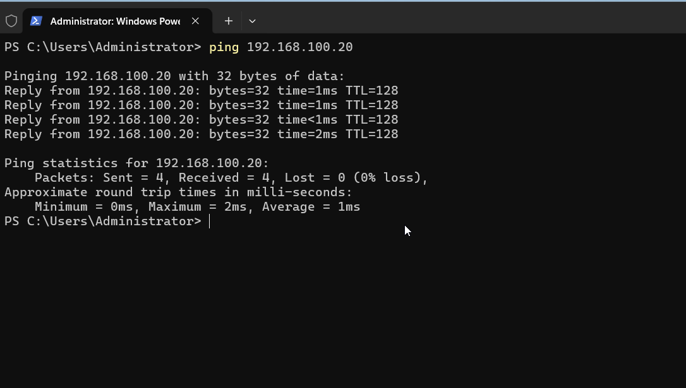
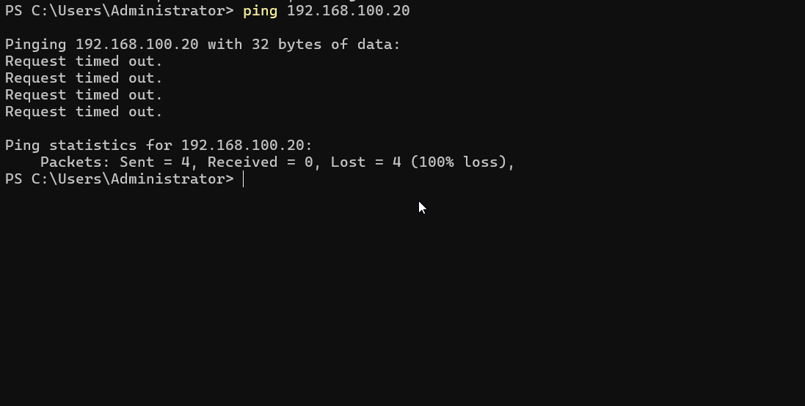

# Windows Firewall as an ACL warm-up

A lightweight look at Windows Defender Firewall on WS01 before building a dedicated firewall VM in
Phase 3 — writing rules that actually change behavior, and testing that they do what I expect
instead of just assuming a rule works because it's saved.

## ICMP: default-deny, and rule precedence

Started by trying to ping WS01 from DC01, expecting it to already work:

```powershell
ping 192.168.100.20
```

It didn't — "Request timed out." That led to a quick unplanned troubleshooting detour rather than
the demo I expected. Checked WS01's active network profile:

```powershell
Get-NetConnectionProfile
```

WS01 was on the `DomainAuthenticated` profile, as expected. Checking the predefined ICMP rule (by
its internal name, `FPS-ICMP4-ERQ-In`, rather than the English display name — this is a German
Windows install, so the display name is localized and doesn't match what's in most documentation):

```powershell
Get-NetFirewallRule -Name "FPS-ICMP4-ERQ-In" | Select-Object DisplayName, Profile, Enabled
```

The rule only exists for the **Private, Public** profiles, disabled by default — there's no
equivalent enabled rule for the **Domain** profile at all. Windows Firewall blocks anything that
isn't explicitly allowed, so with no allow rule for the active profile, inbound ICMP was blocked by
default. Nothing was actually wrong — I'd just assumed ping would work out of the box, and default-
deny had quietly proven otherwise.

That turned into a better exercise than the one I'd planned: instead of just blocking something
that was already blocked, I demonstrated both an explicit allow and an explicit block, and the fact
that block always wins over allow in Windows Firewall regardless of which rule was created first.

Allow rule, scoped to the Domain profile:

```powershell
New-NetFirewallRule -DisplayName "Allow-ICMP-Domain" -Direction Inbound -Protocol ICMPv4 -IcmpType 8 -Profile Domain -Action Allow
```

Ping from DC01 now succeeded.



Then an explicit block rule, on top of the still-existing allow rule:

```powershell
New-NetFirewallRule -DisplayName "Block-ICMP-Domain" -Direction Inbound -Protocol ICMPv4 -IcmpType 8 -Profile Domain -Action Block
```

Ping failed again — proof that an explicit block overrides an allow rule, rather than the two
canceling out or the older rule winning.



## SMB: still open

The plan for the second half of this exercise was to block outbound SMB (port 445) on WS01 and show
that the firewall stops file-share access even though the NTFS permissions from `ad-lab/05-fileserver-acls.md`
would otherwise allow it — a good illustration of the firewall as a control that sits in front of,
and independent from, the ACL layer.

Ran into a permissions issue while testing this: creating and removing firewall rules needs local
administrator rights, and I was testing under `abauer` — the standard, deliberately non-admin
domain account from the least-privilege test in `ad-lab/04-client-join-least-privilege.md`. The
right approach is to run `New-NetFirewallRule`/`Remove-NetFirewallRule` from an elevated session and
only use `abauer` for the actual access attempt, but I put this part on hold for now rather than
finishing it in a rush. Will come back and add it here.

## Why this matters for SOC work

Firewall logs and rule sets are a building block for the real pfSense work planned in Phase 3, and
for reading firewall logs during an investigation in general. The unplanned ICMP troubleshooting
also ended up being a good reminder by itself: "the rule I expected to be there might not be" is
exactly the kind of assumption that causes real misconfigurations, and checking the actual rule
state instead of trusting the documented default caught it here.
