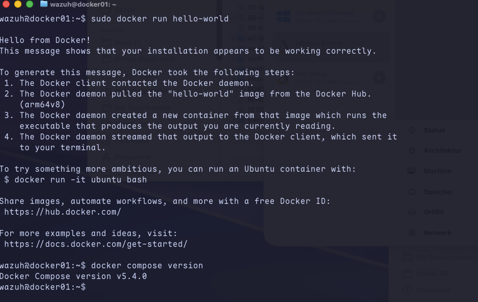

# Docker as a second platform, on the existing Wazuh VM

The first step of the Docker/TheHive/Twingate expansion: get Docker running as the platform for
everything that follows in this phase. Rather than spinning up a new dedicated VM, Docker went on
the existing Ubuntu box that was already running Wazuh (`192.168.100.30`) — no extra RAM overhead
for a whole separate machine, and it's where Wazuh itself ends up living once the migration
(`docker-lab/02-wazuh-migration.md`, planned) happens anyway. DC01 and WS01 stay full VMs on
purpose — a domain controller and an endpoint I do threat hunting on need real OS behavior, not a
container.

## Backup first

Before changing anything, shut the VM down and made a full clone in UTM (the same approach as every
other risky change in this lab — UTM doesn't do live snapshots, so a full duplicate is the practical
rollback point):

```bash
sudo shutdown now
```

Then in UTM: right-click the VM in the library → Duplicate. Started the original VM back up
afterward.

## Renaming the VM: wazuh → docker01

The VM's role has outgrown its old name — it's not just the Wazuh box anymore, it's the Docker host
for Wazuh plus everything else in this phase. Changed the hostname:

```bash
sudo hostnamectl set-hostname docker01
sudo nano /etc/hosts
```

(Updated the `127.0.1.1` line to point at `docker01` instead of `wazuh`.)

```bash
hostname
hostnamectl
```

And the VM's display name in UTM, for consistency, via right-click → rename.

I left the Linux user account itself as `wazuh` — renaming an existing Unix user is a lot more
involved than a hostname change (home directory, file ownership, group memberships, anything
running under that account) for basically no real benefit here. The hostname is what identifies the
machine on the network and in this repo; the login account is just that, a login account.

Rebooted afterward so the new hostname took effect everywhere cleanly:

```bash
sudo reboot
```

## Installing Docker

Used Docker's own apt repository rather than the older `docker.io` package from Ubuntu's default
repos, to get a current version with Compose included:

```bash
sudo apt-get remove -y docker docker-engine docker.io containerd runc 2>/dev/null

sudo apt-get update
sudo apt-get install -y ca-certificates curl gnupg
sudo install -m 0755 -d /etc/apt/keyrings
curl -fsSL https://download.docker.com/linux/ubuntu/gpg | sudo gpg --dearmor -o /etc/apt/keyrings/docker.gpg
sudo chmod a+r /etc/apt/keyrings/docker.gpg

echo \
  "deb [arch=$(dpkg --print-architecture) signed-by=/etc/apt/keyrings/docker.gpg] https://download.docker.com/linux/ubuntu \
  $(. /etc/os-release && echo "$VERSION_CODENAME") stable" | \
  sudo tee /etc/apt/sources.list.d/docker.list > /dev/null
sudo apt-get update

sudo apt-get install -y docker-ce docker-ce-cli containerd.io docker-buildx-plugin docker-compose-plugin
```

### Two small snags along the way

**`apt-get` couldn't get the dpkg lock.** `unattended-upgrades` — the automatic security-update
service set up back in `linux-lab/01-ssh-hardening.md` — was running in the background and holding
the package lock at the same time. Rather than force-removing the lock file (which the error message
itself warns against, correctly), just waited for it to finish and re-ran the install. A good
reminder that the lock exists for a reason, and it's actually reassuring evidence that the earlier
automatic-updates setup is doing its job unattended.

**A pending kernel upgrade.** The same background update had already installed a new kernel version
that wasn't loaded yet, and `needrestart` flagged it after the install. Handled it with the reboot
that was already planned as part of the hostname change, so the new kernel and the new hostname both
took effect at once.

## Verifying it works

```bash
sudo docker run hello-world
docker compose version
```



Added my own user to the `docker` group so I don't need `sudo` for every Docker command, then logged
out and back in for the group membership to take effect:

```bash
sudo usermod -aG docker $USER
```

Confirmed it works without `sudo` afterward:

```bash
docker run hello-world
```

## Why this matters for SOC work

Most modern security tooling — Wazuh, TheHive, MISP, Suricata — ships as official Docker images
rather than something you compile or install by hand, so being comfortable with Docker is table
stakes for standing up this kind of tooling quickly. Just as important is judging what belongs in a
container and what doesn't: a domain controller or an endpoint I actively investigate needs to
behave like a real machine, not a stripped-down container — knowing the difference is part of the
skill, not just running `docker compose up` on everything.
