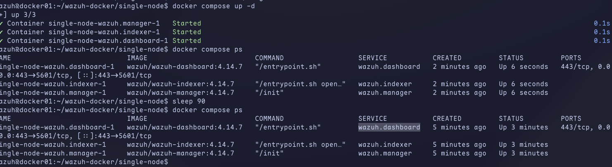
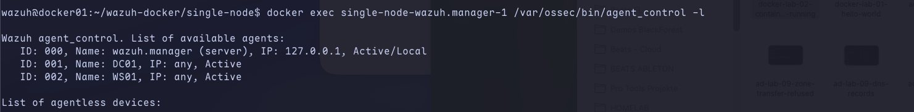
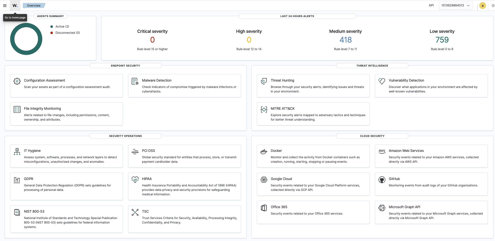

# Migrating Wazuh from a native install to Docker

The core exercise of Phase 2b: move the Wazuh SIEM (manager, indexer, dashboard) from the native
apt-installed services on `docker01` to the official Wazuh Docker containers, on the same machine —
without losing agent registrations, custom configuration, or downtime beyond a short, planned
cutover window. Migrating a live service without breaking it is a different skill from a fresh
install, and this is a service I actually rely on, not a throwaway lab instance.

## Cutover plan

1. Back up the manager config, custom rules/decoders, agent registration keys, indexer data, and
   dashboard config.
2. Clone the official `wazuh-docker` repo at the tag matching the installed version, generate TLS
   certificates for the stack.
3. Stop the native services to free the ports the containers need.
4. Start the containers, restore the backed-up `client.keys` and custom rules into the manager
   before agents try to reconnect.
5. Verify: agents reconnect without re-enrolling, dashboard reachable, manager talking to the
   indexer.
6. Disable (not remove) the native services — they stay installed as an instant rollback path until
   the Docker stack has proven stable.

## Rollback plan

If anything had failed: `docker compose down`, then `sudo systemctl enable --now wazuh-indexer
wazuh-manager wazuh-dashboard` — back to the known-good native install in under a minute, since the
packages were never uninstalled. A full VM clone (taken before touching anything) was the backstop
behind that.

## Backup, before touching anything

Shut the VM down and cloned it in UTM first — the same rollback pattern used for every risky change
in this lab.

Then, with the VM back up, backed up the four things that actually matter for a clean migration:

```bash
# Manager configuration and custom rules/decoders
sudo tar -czvf ~/wazuh-backup-ossec-conf.tar.gz /var/ossec/etc/ossec.conf /var/ossec/etc/rules /var/ossec/etc/decoders

# Agent registration keys — without these, DC01 and WS01 would have to re-enroll from scratch
sudo cp /var/ossec/etc/client.keys ~/wazuh-backup-client.keys

# Indexer data (the event history)
sudo tar -czvf ~/wazuh-backup-indexer-data.tar.gz /var/lib/wazuh-indexer

# Dashboard configuration
sudo tar -czvf ~/wazuh-backup-dashboard.tar.gz /etc/wazuh-dashboard
```

Checked available disk space against what Docker would need — 7.7 GB free was too tight for the
combined Wazuh images (indexer + manager + dashboard easily add up to several GB) plus running
container data, so grew the VM's disk in UTM first (56 GB total afterward) and extended the LVM
volume inside Ubuntu (`growpart`, `pvresize`, `lvextend`, `resize2fs`) before going any further.

## Deploying the containers

Cloned the official repo at the tag matching the installed version (`v4.14.7`) and generated the
stack's TLS certificates:

```bash
git clone https://github.com/wazuh/wazuh-docker.git -b v4.14.7
cd wazuh-docker/single-node
docker compose -f generate-indexer-certs.yml run --rm generator
```

Stopped the native services first — they were still holding the ports the containers need
(`9200`, `1514`, `1515`, `55000`, `443`):

```bash
sudo systemctl stop wazuh-dashboard wazuh-manager wazuh-indexer
```

Confirmed the ports were actually free (`ss -tulpn`) before starting the containers — the first
`docker compose up -d` attempt, run before stopping the native services, failed outright on a port
conflict on 9200, which was the reminder to do it in the right order.

```bash
docker compose up -d
```

## An unrelated networking bug

Even after the port conflict was resolved, the manager couldn't reach the indexer:
`lookup wazuh.indexer: no such host`. `docker inspect` showed both containers with an empty
`NetworkSettings.Networks` — they weren't actually attached to any Docker network. Root cause: the
first, failed `docker compose up` attempt had already created the containers before it errored out
on the port conflict, and the second (successful-looking) `up -d` just started those already-broken
containers rather than recreating them properly.

Fixed with a full teardown and rebuild — `docker compose down` (removes containers, not volumes)
followed by `docker compose up -d` — which recreated the containers with correct network attachment
without touching the data already sitting in the named volumes.

## Restoring the agent keys and custom rules

With the containers up and network-healthy, restored the backed-up state into the manager container
before agents had a chance to try reconnecting with a manager that didn't recognize them yet:

```bash
mkdir ~/wazuh-restore-staging
cd ~/wazuh-restore-staging
tar -xzvf ~/wazuh-backup-ossec-conf.tar.gz

cd ~/wazuh-docker/single-node
docker compose stop wazuh.manager

docker cp ~/wazuh-backup-client.keys single-node-wazuh.manager-1:/var/ossec/etc/client.keys
docker cp ~/wazuh-restore-staging/var/ossec/etc/rules/. single-node-wazuh.manager-1:/var/ossec/etc/rules/
docker cp ~/wazuh-restore-staging/var/ossec/etc/decoders/. single-node-wazuh.manager-1:/var/ossec/etc/decoders/

docker compose start wazuh.manager
```

Left the container-generated `ossec.conf` alone rather than overwriting it with the native version —
the container's copy has connection details specific to the Docker network (how the manager finds
the indexer), and overwriting it risked breaking exactly the thing we were trying to fix.



## What I deliberately didn't migrate: the old indexer data

The indexer backup (7.5 MB compressed) held the event history from earlier lab exercises. By the
time it would have made sense to restore it, the new Docker indexer had already been running for a
few minutes and had started accumulating its own fresh data and cluster metadata — overwriting that
with a raw copy of the old data risked corrupting the cluster rather than just losing some old test
alerts. On top of that, the original backup itself was a live file copy taken while the native
indexer was still running, not a proper consistent snapshot, so it wasn't a fully safe source to
restore from in the first place.

The correct way to do this would be OpenSearch's snapshot/restore API — register a snapshot
repository, take a consistent snapshot of the old indexer, restore it into the new one. For a
handful of test alerts from a home lab, that was more engineering effort than the data was worth, so
I made the call to leave the old history behind and start clean going forward. Documenting that as a
deliberate trade-off rather than pretending it isn't a gap.

## Verifying the migration

Agent reconnection, without touching DC01 or WS01 at all:

```bash
docker exec single-node-wazuh.manager-1 /var/ossec/bin/agent_control -l
```



Both agents reconnected on their own — no re-enrollment needed on either machine, confirming the
`client.keys` restore worked. (WS01 briefly showed "Disconnected" at one point during testing,
which turned out to just be because the WS01 VM itself was powered off at the time, not a migration
problem — it reconnected normally once WS01 was back up.)

Dashboard, from a browser on the Mac:



## Closing the cutover

With agents reconnected and the dashboard confirmed working, disabled the native services —
deliberately not removed, so there's still a one-command rollback available if something surfaces
later:

```bash
sudo systemctl disable wazuh-manager wazuh-indexer wazuh-dashboard
```

Rebooted the VM as a final end-to-end test, confirming the containers (which have `restart: always`
set) and Docker itself both come back automatically, without the native services fighting them for
ports again.

## Why this matters for SOC work

This is what a real service migration actually looks like: back up the right things first, plan for
rollback before starting, and expect at least one thing to go sideways that has nothing to do with
the plan (the empty-network bug had nothing to do with the migration steps I'd actually planned for
— it was leftover damage from an earlier failed command). Deciding to deliberately leave the old
event history behind, and writing down why, is also a real part of the job — not every backup is
worth restoring, and being able to make and justify that call under time and effort constraints
matters more than blindly trying to preserve everything.
