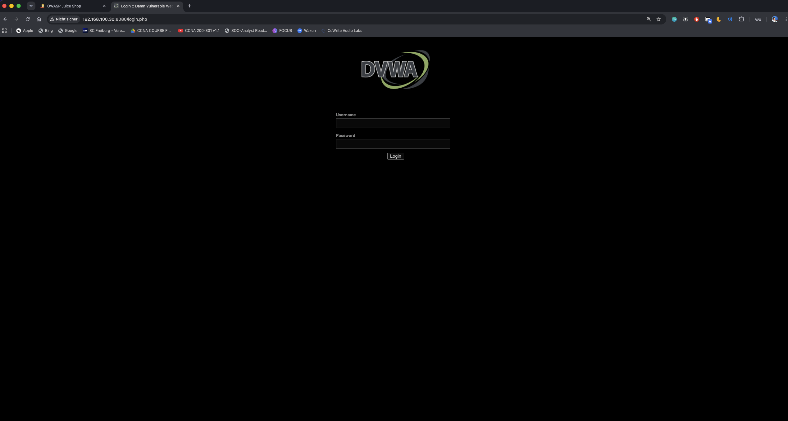
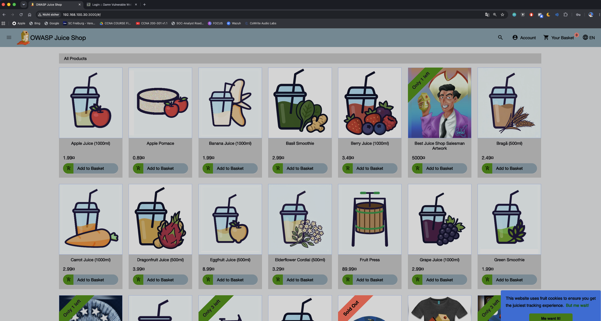

# DVWA and Juice Shop: deliberately vulnerable Docker targets

Two intentionally vulnerable web apps, stood up fresh in Docker on `docker01` — not migrated from
anywhere, there was no prior instance. These exist for two things planned later in the roadmap: a
WAF project (nginx + ModSecurity/OWASP CRS, or pfSense as a WAF layer, Phase 3) and giving Wazuh
something realistic to detect attacks against, instead of only ever attacking the "real" lab
machines (DC01, WS01).

## Isolated from the rest of the lab

Both run in their own Docker Compose project, on their own bridge network (`vuln-net`), completely
separate from the Wazuh stack's network (`single-node_default`). They can't reach the Wazuh
containers directly — only the specific host ports I exposed (`8080` for DVWA, `3000` for Juice
Shop) are reachable at all, and only from the lab network, same as everything else here.

```yaml
services:
  dvwa:
    image: vulnerables/web-dvwa
    container_name: dvwa
    restart: unless-stopped
    profiles:
      - pentest
    ports:
      - "8080:80"
    networks:
      - vuln-net

  juice-shop:
    image: bkimminich/juice-shop
    container_name: juice-shop
    restart: unless-stopped
    profiles:
      - pentest
    ports:
      - "3000:3000"
    networks:
      - vuln-net

networks:
  vuln-net:
    driver: bridge
```

```bash
docker compose --profile pentest up -d
```

## Not running by default

Both containers sit behind the `pentest` [Compose profile](https://docs.docker.com/compose/how-tos/profiles/).
A plain `docker compose up -d` in this project directory ignores them entirely, so they don't come
back on a host reboot or when I bring the rest of the lab up — most days I don't need attack targets
running, just the Wazuh stack. To use them:

```bash
docker compose --profile pentest up -d      # start
docker compose --profile pentest down       # stop and remove
```

`restart: unless-stopped` is still useful *within* a pentest session — if the VM reboots while I'm
mid-exercise, they come back up rather than needing a manual restart — but it only takes effect once
a container has actually been created via the profile; it doesn't override the profile filter itself.

## DVWA needed x86 emulation [ARM/UTM, historical]

> This whole section is a snapshot of a problem that no longer exists: `docker01` is now Ubuntu
> x86_64 on Proxmox VE, so DVWA's amd64-only image runs natively with no emulation layer needed at
> all. Kept for the record — see
> [05-hardware-migration.md](05-hardware-migration.md).

Juice Shop started cleanly — its image is multi-arch and runs natively on ARM64. DVWA didn't:

```
exec /main.sh: exec format error
```

The `vulnerables/web-dvwa` image only ships an `amd64` build, and this VM is ARM64 (Apple Silicon,
same as every other machine in this lab). "exec format error" is the telltale sign the host has no
emulation layer registered at all for foreign-architecture binaries — Docker doesn't emulate
anything on its own, it needs `binfmt_misc` handlers pointing at an emulator like QEMU.

```bash
docker run --privileged --rm tonistiigi/binfmt --install all
docker compose up -d --force-recreate dvwa
```

That registers the QEMU user-mode emulators system-wide, and DVWA started cleanly afterward — slower
than a native container would be, but perfectly usable for a lab.





## Why this matters for SOC work

Having deliberately vulnerable, disposable targets in the same lab as the SIEM means I can generate
realistic attack traffic — SQL injection, XSS, broken auth — on demand and watch how (or whether) it
shows up in detection, without touching the actual domain-joined machines. It's also a preview of a
recurring theme in real infrastructure: knowing when to reach for architecture emulation instead of
assuming every container image just works everywhere, which matters a lot on ARM hardware
specifically.
