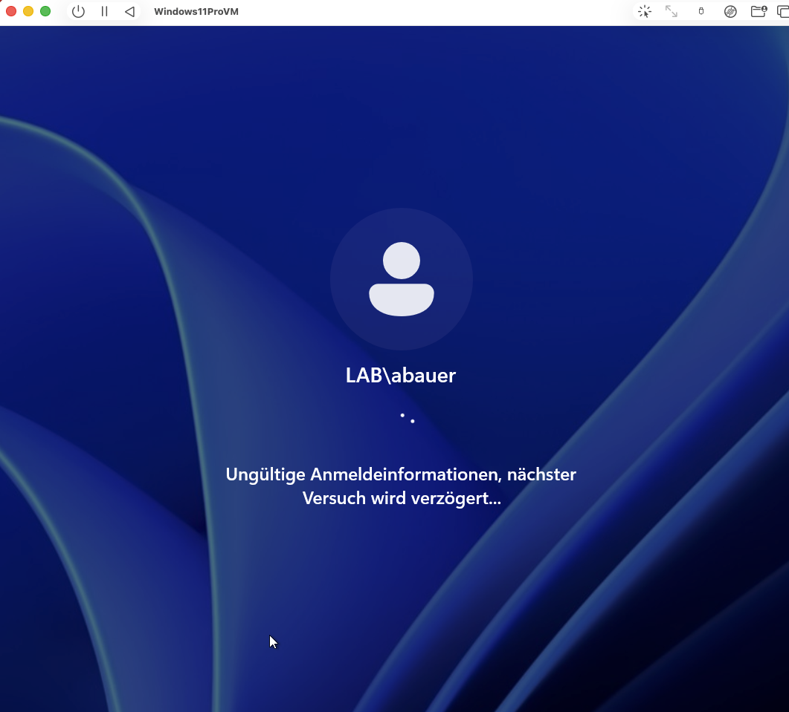
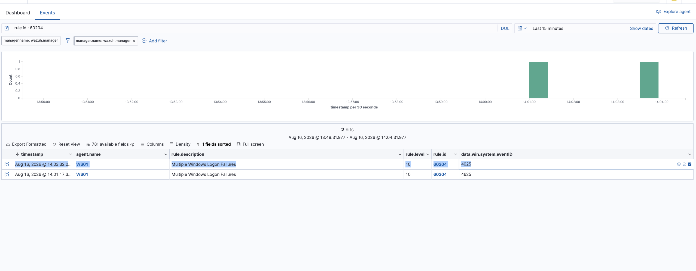
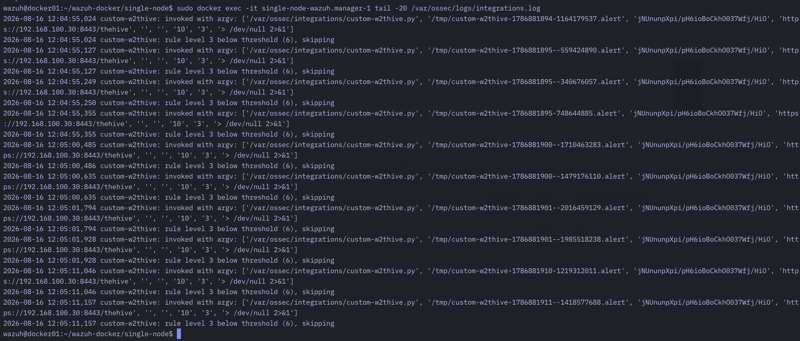
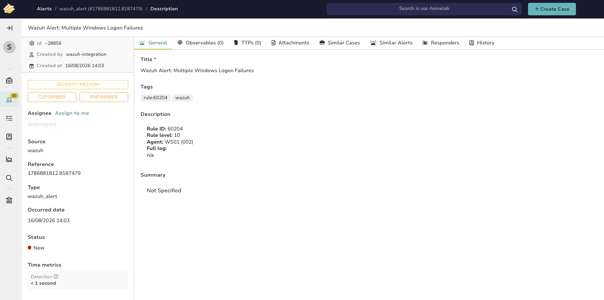
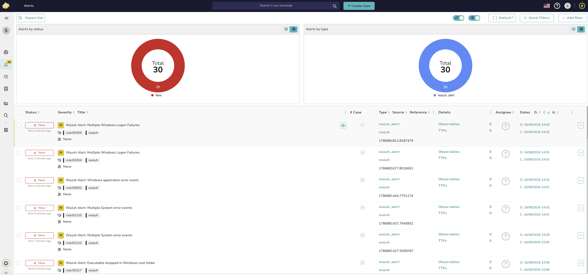

# TheHive and Cortex: closing the detection-to-response gap

Everything so far in this lab answers "did something happen?" — Wazuh generates an alert, I open it
in the dashboard, I read it, and then... it just sits there. That's only half of what a SOC actually
does. The other half is case management: turning an alert into a tracked case, working it, and being
able to show what happened to it afterward. This step closes that gap by standing up TheHive
(incident-response case management) and Cortex (its analysis/enrichment engine) in Docker on
`docker01`, and then wiring Wazuh's own alerts into TheHive so a real detection becomes a real case
instead of disappearing once I've looked at it once.

## Deploying TheHive and Cortex

Both run in Docker via StrangeBee's own `docker-thehive4` Compose repo, using its `testing` profile —
the quickest path to a working TheHive + Cortex + backing-store stack without hand-rolling the
Compose file myself. That brought up four containers: `nginx` as the reverse proxy in front of
everything, `thehive` itself, `cortex`, and their two separate backing stores — Cassandra for TheHive
and Elasticsearch for Cortex. Both of those are JVM-based and turned out to matter a lot later (see
the RAM section below) — this stack is considerably heavier than Wazuh alone.

Set up an organization and a user in TheHive, and separately a superadmin, an organization, a user,
and an API key in Cortex — the two tools don't share user management, they're connected as two
separate services that talk to each other over one integration.

**The gotcha:** connecting Cortex to TheHive as an analysis engine needs Cortex's URL from *inside*
the Docker network, not the URL I use in my own browser. My browser reaches Cortex through the
`nginx` reverse proxy on its externally exposed port, but TheHive's own backend talks to Cortex
directly, container-to-container, over the internal Compose network — where Cortex listens on its
own port (`9001`) under its own service name (`cortex`), not `localhost` and not the exposed port.
The working URL was `http://cortex:9001/cortex`, not the address I had in my browser tab. Easy to
miss because "it works in my browser" doesn't mean "the other container can reach it the same way" —
two different network paths to what looks like the same service.

## Wiring Wazuh into TheHive

Wazuh doesn't know how to talk to TheHive out of the box. Wazuh's integration model is: an alert
matches a rule, and if a rule level passes a threshold, Wazuh hands the alert off (as JSON) to a
script I provide, which is free to do whatever it wants with it — in this case, turn it into a
TheHive alert over TheHive's REST API.

### thehive4py v1 vs v2

I already had TheHive-integration code from a while back, but it turned out to target `thehive4py`
v1, which talks to TheHive's old (pre-5.x) API. TheHive 5.7.3 uses a newer API that v1 doesn't speak
at all. Rather than patch around a version mismatch, I rewrote the integration against `thehive4py`
v2 (`2.1.0`), whose import paths and object model are different:

```python
from thehive4py.client import TheHiveApi
from thehive4py.types.alert import InputAlert
```

### The two files

Wazuh's custom-integration convention is a plain wrapper script (no extension, executable) that Wazuh
actually invokes, plus the real implementation behind it — this keeps Wazuh's invocation contract (a
fixed argv: alert file, API key, hook URL) separate from whatever language the implementation is
written in.

`/var/ossec/integrations/custom-w2thive` (the wrapper):

```bash
#!/bin/sh
WPYTHON_BIN=/var/ossec/framework/python/bin/python3
SCRIPT_PATH=/var/ossec/integrations/custom-w2thive.py

exec ${WPYTHON_BIN} ${SCRIPT_PATH} "$@"
```

`/var/ossec/integrations/custom-w2thive.py` (the implementation):

```python
#!/var/ossec/framework/python/bin/python3
import sys
import json
import logging

from thehive4py.client import TheHiveApi
from thehive4py.types.alert import InputAlert

LOG_FILE = "/var/ossec/logs/integrations.log"

logging.basicConfig(
    filename=LOG_FILE,
    level=logging.INFO,
    format="%(asctime)s custom-w2thive: %(message)s",
)

def map_severity(rule_level):
    # Wazuh rule level -> TheHive severity (1=low, 2=medium, 3=high, 4=critical)
    if rule_level >= 15:
        return 4
    if rule_level >= 12:
        return 3
    if rule_level >= 6:
        return 2
    return 1

def main():
    logging.info(f"invoked with argv: {sys.argv}")

    try:
        alert_file_path = sys.argv[1]
        api_key = sys.argv[2]
        hook_url = sys.argv[3]
    except IndexError:
        logging.error("missing required arguments: alert_file, api_key, hook_url")
        sys.exit(1)

    with open(alert_file_path) as f:
        alert_json = json.load(f)

    rule = alert_json.get("rule", {})
    rule_level = rule.get("level", 0)

    if rule_level < 6:
        logging.info(f"rule level {rule_level} below threshold (6), skipping")
        sys.exit(0)

    send_to_thehive(alert_json, api_key, hook_url)

def send_to_thehive(alert_json, api_key, hook_url):
    api = TheHiveApi(url=hook_url, apikey=api_key, verify=False)

    rule = alert_json.get("rule", {})
    agent = alert_json.get("agent", {})

    title = f"Wazuh Alert: {rule.get('description', 'unknown rule')}"
    description = (
        f"**Rule ID:** {rule.get('id')}\n"
        f"**Rule level:** {rule.get('level')}\n"
        f"**Agent:** {agent.get('name')} ({agent.get('id')})\n\n"
        f"**Full log:**\n{alert_json.get('full_log', 'n/a')}"
    )

    observables = []
    src_ip = alert_json.get("data", {}).get("srcip")
    if src_ip:
        observables.append({
            "dataType": "ip",
            "data": src_ip,
            "message": "Source IP extracted from Wazuh alert",
            "ioc": True,
        })

    alert = InputAlert(
        title=title,
        description=description,
        type="wazuh_alert",
        source="wazuh",
        sourceRef=str(alert_json.get("id", "")),
        severity=map_severity(rule.get("level", 0)),
        tags=["wazuh", f"rule:{rule.get('id')}"],
        observables=observables,
    )

    created = api.alert.create(alert=alert)
    logging.info(f"created TheHive alert: {created}")

if __name__ == "__main__":
    try:
        main()
    except Exception as e:
        logging.exception(f"unhandled error in custom-w2thive: {e}")
        sys.exit(1)
```

The rule-level threshold (`< 6` gets skipped) is deliberate — it keeps low-severity noise like a
single failed login (level 5) out of TheHive entirely, and only forwards things actually worth a
case, like the frequency-based brute-force rule. The severity mapping turns Wazuh's 1-15 rule-level
scale into TheHive's four-point severity scale, and the source IP (when Wazuh extracted one) gets
pulled out as an observable so it's immediately usable for enrichment in TheHive/Cortex, not just
buried in a text description.

### Getting it into the Wazuh manager container

Since Wazuh runs as a Docker container now (`docker-lab/02-wazuh-migration.md`), the integration
files need to end up inside `single-node-wazuh.manager-1`, not on the Docker host. Wazuh's bundled
Python (`/var/ossec/framework/python/`) is deliberately isolated from the system Python — and its
`bin/` directory has no `pip3` binary at all, even though the `pip` *module* is there:

```bash
docker exec single-node-wazuh.manager-1 /var/ossec/framework/python/bin/python3 -m pip install thehive4py
```

`python3 -m pip` works even without the standalone `pip3` executable, and installed
`thehive4py-2.1.0` cleanly into Wazuh's own Python environment.

Copied both files in with `docker cp`, then set the ownership and permissions Wazuh expects for
anything under `integrations/`:

```bash
docker cp custom-w2thive single-node-wazuh.manager-1:/var/ossec/integrations/custom-w2thive
docker cp custom-w2thive.py single-node-wazuh.manager-1:/var/ossec/integrations/custom-w2thive.py
docker exec single-node-wazuh.manager-1 chown root:wazuh /var/ossec/integrations/custom-w2thive /var/ossec/integrations/custom-w2thive.py
docker exec single-node-wazuh.manager-1 chmod 750 /var/ossec/integrations/custom-w2thive /var/ossec/integrations/custom-w2thive.py
```

And told Wazuh about the integration in `ossec.conf`:

```xml
<ossec_config>
  <integration>
    <name>custom-w2thive</name>
    <hook_url>https://192.168.100.30:8443/thehive</hook_url>
    <api_key>REDACTED</api_key>
    <alert_format>json</alert_format>
  </integration>
</ossec_config>
```

(Real value substituted in on the box itself, not committed to the repo — same reasoning as blacking
out passwords in screenshots.)

## Two real problems along the way

### xmllint was the wrong diagnostic tool

After editing `ossec.conf`, the manager wouldn't start: `wazuh-analysisd: ERROR: (1226): Error
reading XML file 'etc/ossec.conf': (line 0)`. My first instinct was `xmllint --noout ossec.conf`,
which reported "Extra content at the end of the document" — but that's actually **expected** here,
not a bug: Wazuh's `ossec.conf` is a series of separate, concatenated `<ossec_config>...</ossec_config>`
blocks, one after another. That's valid to Wazuh's own parser but not to strict XML, so a generic XML
validator will always flag it, config-corruption or not. Wrong tool for this file — I switched to
just inspecting the tag structure directly:

```bash
grep -n "<ossec_config>\|</ossec_config>" ossec.conf
```

### The real cause: Apple Notes silently corrupting the config

Direct inspection showed the real problem: I'd edited the command (substituting in the real API key)
inside Apple Notes before pasting it into the terminal, and Notes' "Smart Punctuation" feature
silently swaps some characters for visually-identical Unicode look-alikes. `grep` found one fewer
`<ossec_config>` block than `tail` visually showed — proof the last block's tags weren't the literal
ASCII characters they looked like on screen. Confirmed with:

```bash
grep -n -P "[^\x00-\x7F]" ossec.conf
```

Fixed it by truncating the file back to the last known-good line, re-appending the integration block
fresh via a heredoc (still with a placeholder for the key), and substituting the real key with `sed`
run directly in the terminal — no GUI text editor involved at any point in that path:

```bash
sed -i 's#PLACEHOLDER_HERE#<api-key>#' ossec-fixed.conf
```

(Used `#` as the `sed` delimiter instead of the default `/`, since the API key itself contains
forward slashes — with `/` as the delimiter, `sed` reads the key's own slashes as extra, malformed
delimiters.)

Lesson worth keeping: never edit a command destined for the terminal inside a rich-text app like
Notes or TextEdit's default mode. It looks identical on screen right up until it silently isn't.

### Running out of RAM

Copied the container back in and restarted, and the whole Wazuh manager came up broken — every core
daemon down, the dashboard showing "API is down". `free -h` explained why: this stack (Wazuh manager
+ indexer + dashboard, TheHive, Cortex, Cassandra, Elasticsearch, and the DVWA/Juice Shop targets, all
on one 9.2 GiB VM) had pushed available memory down into three digits of MiB, with DVWA itself
crash-looping from OOM pressure. Stopped the two attack-target containers for headroom
(`docker stop dvwa juice-shop`), which helped a little but wasn't the actual root cause of the
manager crash — that was the XML corruption above. Once the config was fixed, the manager daemons
came up cleanly. Memory stayed genuinely tight even afterward (double-digit MiB free, swap in active
use) — noted as an open fragility risk. The real fix is more RAM for `docker01` (a UTM setting that
needs the VM fully stopped to change), which I'm deliberately treating as a separate task rather than
rushing it into this session.

## Testing it

### First, an isolated test

Before trusting a real attack to prove the pipeline, I built a synthetic Wazuh alert JSON by hand
(rule level 10, well above the threshold) and ran the integration script against it directly,
bypassing Wazuh's own alert pipeline. That came back clean — a real alert landed in TheHive with the
title, description, severity, and tags all mapped correctly — which told me the TheHive side of the
integration (auth, API shape, `InputAlert` construction) worked before I went looking for a real
trigger.

One extra snag here, unrelated to the integration itself: my own analyst account in TheHive
(`Jonas Analyst`) came back "Authentication error" on login. Its `Type` was set to `Service` (meant
for API-key-only access, not interactive login) and it had `Locked` enabled. Fixed by switching the
type to `Normal`, clearing `Locked`, and setting a password.

### Then, a real end-to-end test

The synthetic alert proves the TheHive side works, but not that Wazuh's own detection actually
triggers it — for that I needed a real brute-force against WS01, the same scenario as
`incident-writeups/01-bruteforce.md`. Reading that write-up first paid off: the original test only
ever reached rule 60122 (a single failed logon, level 5) — below this integration's level-6
threshold. To reliably hit the frequency-based rule instead (60204, "Multiple Windows Logon
Failures", level 10), I needed considerably more failed attempts in quick succession than "a few".
Windows' own sign-in throttling ("invalid credentials, next attempt will be delayed") slows this down
but doesn't block it — it's a different mechanism from AD account lockout, which is currently disabled
in this lab (`LockoutThreshold: 0`, set during the password-policy work in `ad-lab/03-gpo-hardening.md`)
— so nothing interrupted the run this time.



Fifteen or so rapid failed logons against `LAB\abauer` on WS01 was enough. Filtering Wazuh's own
Events view for `rule.id : 60204` showed two hits — WS01, rule level 10, "Multiple Windows Logon
Failures", built from Windows event 4625:



`integrations.log` on the manager shows the threshold filter actively working, not just existing on
paper — every low-level event (rule level 3, ordinary Windows noise well under the level-6 cutoff)
gets logged as skipped rather than silently ignored, which is exactly the behavior I wrote the
threshold check for:



And the alert that mattered — rule 60204 — made it all the way through to a real TheHive alert:



Created by the `wazuh-integration` API user, tagged `wazuh` and `rule:60204`, severity mapped to
Medium exactly as `map_severity()` intended for a level-10 rule.

Pulling up TheHive's Alerts overview shows the bigger picture: 30 alerts total, including the two
from this test plus a batch of unrelated ones (Windows application errors, "Executable dropped in
Windows root folder", and more) that Wazuh had already been sending across at level 6+ without me
specifically watching for them:



That's worth keeping an eye on going forward — with the manager forwarding everything at level 6 and
above, alert volume in TheHive can grow faster than I'd triage by hand in a real shift. A tighter
threshold, or grouping/deduplication rules, is a reasonable next tuning step once there's more data
to judge it by — not something to over-engineer from a single day of lab traffic.

## Why this matters for SOC work

Wazuh detecting something is only the first half of the job. The second half — turning a detection
into a tracked, working case with context, severity, and an audit trail — is what TheHive adds, and
it's the part of the job that's actually Tier-1 analyst work day to day: triage, document, escalate,
close. Getting the pipeline itself right (matching a modern API version instead of assuming old
integration code still works, threshold-filtering noise before it becomes case overload, extracting
observables instead of leaving everything as unstructured text) is the same kind of judgment call a
real SOC has to make about what's worth a human's attention and what isn't.
