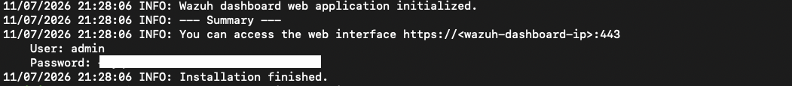
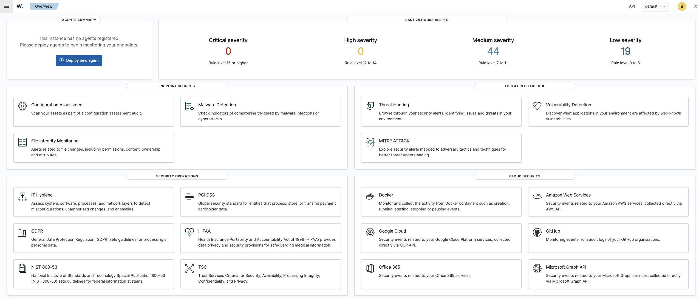
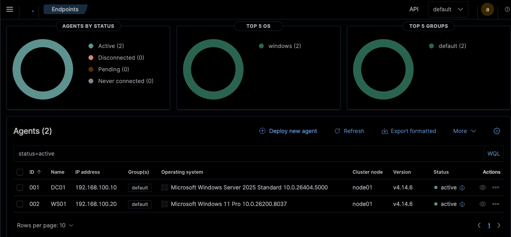

# Step 3 — Wazuh, the SIEM

A SIEM ("Security Information and Event Management") is the tool a SOC analyst spends most of the day
in. It collects logs from many machines in one place, applies rules to them, and raises alerts when
something looks suspicious. I'm using **Wazuh**, which is free and open-source.

Goal for this step: one Ubuntu machine running Wazuh, collecting logs from DC01 and WS01.

## 1. Create the Ubuntu virtual machine in UTM

- New VM → **Virtualize** → **Linux**, pick the Ubuntu Server ARM64 ISO
- **"Use Apple Virtualization" turned off** (QEMU), one network card on **Shared Network** with the
  values from [step 0](00-prerequisites.md)
- 4 GB RAM, 40 GB disk
- During the Ubuntu installer, tick **"Install OpenSSH server"** so I can connect from the Mac's
  terminal (much nicer than typing in the small VM window)

One trap during the install: on the storage screen Ubuntu only uses about half the disk by default.
When it shows the summary, click the `ubuntu-lv` volume and set its size to the maximum, otherwise
Wazuh runs out of space later. (If you forget, you can fix it afterwards — see
[99-troubleshooting](99-troubleshooting.md).)

## 2. Give it a fixed IP

Ubuntu uses a file for network settings. Edit `/etc/netplan/50-cloud-init.yaml` (the interface is
usually `enp0s1`, check with `ip -br a`):

```yaml
network:
  version: 2
  ethernets:
    enp0s1:
      dhcp4: no
      addresses: [192.168.100.30/24]
      routes:
        - to: default
          via: 192.168.100.15
      nameservers:
        addresses: [1.1.1.1, 8.8.8.8]
```

```bash
sudo chmod 600 /etc/netplan/50-cloud-init.yaml
sudo netplan apply
```

## 3. Install Wazuh

One script installs all three parts of Wazuh (the manager, the database/indexer, and the web
dashboard):

```bash
curl -sO https://packages.wazuh.com/4.14/wazuh-install.sh
sudo bash ./wazuh-install.sh -a
```

It takes 5–15 minutes. At the end it prints the login for the `admin` user — save that password in a
password manager, not in this repo. The web dashboard is then reachable from the Mac's browser at
`https://192.168.100.30` (accept the certificate warning; it's self-signed).



## 4. Connect the agents on DC01 and WS01

An "agent" is a small program on each Windows machine that ships its logs to Wazuh.

- In the dashboard: **Agents → Deploy new agent → Windows**, set the server address to
  `192.168.100.30`, give it a name (`DC01` / `WS01`)
- Run the command it generates in PowerShell (as Administrator) on that machine
- Start it with `NET START WazuhSvc`

Both machines should then show up as **active** in the dashboard.





## 5. Add Sysmon for much better logs

By itself Windows logs are okay, but **Sysmon** (a free Microsoft tool) adds detailed events like
"a new program started" or "a network connection was made" — exactly the things you want when
hunting for attacks.

On DC01 and WS01:

1. Install Sysmon with a good ready-made config (SwiftOnSecurity's):
   ```powershell
   .\Sysmon64a.exe -accepteula -i sysmonconfig-export.xml
   ```
2. Tell the Wazuh agent to also read Sysmon's log channel by adding this to
   `C:\Program Files (x86)\ossec-agent\ossec.conf`:
   ```xml
   <localfile>
     <location>Microsoft-Windows-Sysmon/Operational</location>
     <log_format>eventchannel</log_format>
   </localfile>
   ```
3. Restart the agent: `Restart-Service WazuhSvc`

There's a ready-to-paste version of that snippet in [`../configs/`](../configs/).

Still missing: a screenshot of the Sysmon events actually arriving in the dashboard — I'll add it
next time I'm in there.
