# Hardening the Wazuh Ubuntu VM

The Wazuh VM had been running with password-based SSH login, no firewall, and no automatic
security updates since I first set it up. This page covers the full hardening pass: key-based SSH
login only, Fail2ban against brute-force attempts, a UFW firewall restricted to the lab subnet,
removing services the VM doesn't actually need, and automatic security updates.

## Why this matters

SSH is the most common way into any internet-facing Linux box. Password logins can be brute-forced;
a stolen or guessed password is often all an attacker needs. Key-based login removes that entire
attack path — without the private key, password guessing doesn't get you anywhere. Fail2ban adds a
second layer on top: it watches the auth log and temporarily bans IPs that fail to log in
repeatedly, which slows down or stops automated brute-force tools even against services that still
allow some form of password prompt (or against other daemons later on).

## Setting up key-based login

On my Mac (not on the VM itself):

```bash
ssh-keygen -t ed25519 -C "wazuh-lab"
ssh-copy-id wazuh@192.168.100.30
```

`ssh-copy-id` connects once with my existing (password) credentials and appends the new public key
to `~/.ssh/authorized_keys` on the VM. After that, `ssh wazuh@192.168.100.30` logs in with the key,
no password prompt.

## Turning off password login

With the key working, password authentication becomes unnecessary — and a live weak point if left
enabled, so I disabled it in `/etc/ssh/sshd_config`:

```
PasswordAuthentication no
PermitRootLogin no
```

`PermitRootLogin no` closes off the more damaging half of the same problem: even if something did
guess a password, it couldn't be root's.

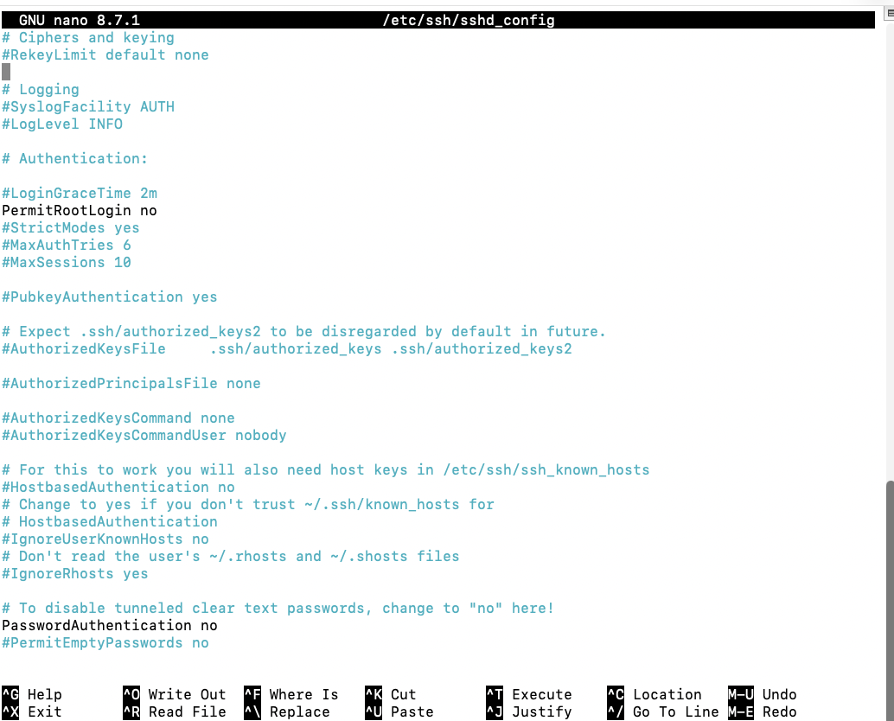

### The catch: `sshd_config.d` overrides the main file

Restarting `sshd` and testing didn't work at first — password login still succeeded. The reason:
Ubuntu's default `sshd_config` includes everything in `/etc/ssh/sshd_config.d/*.conf` at the very
top of the file, and `sshd` uses the *first* value it finds for a given setting. A cloud-init
generated file in that folder, `50-cloud-init.conf`, had its own `PasswordAuthentication yes`,
which was being read before my change in the main file — so it won.

```bash
sudo nano /etc/ssh/sshd_config.d/50-cloud-init.conf
```

Changed `yes` to `no` there instead, and restarted `sshd` again.

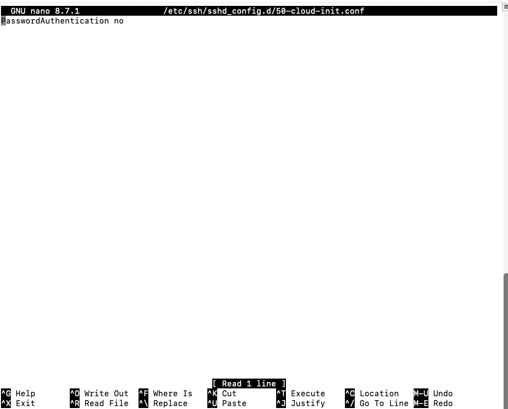

```bash
sudo systemctl restart sshd
```

## Verifying it

Before closing the working SSH session, I opened a new terminal window and tested there first —
important, since a mistake in `sshd_config` can otherwise lock you out with no way back in except
the UTM console.

Key login, no password prompt:

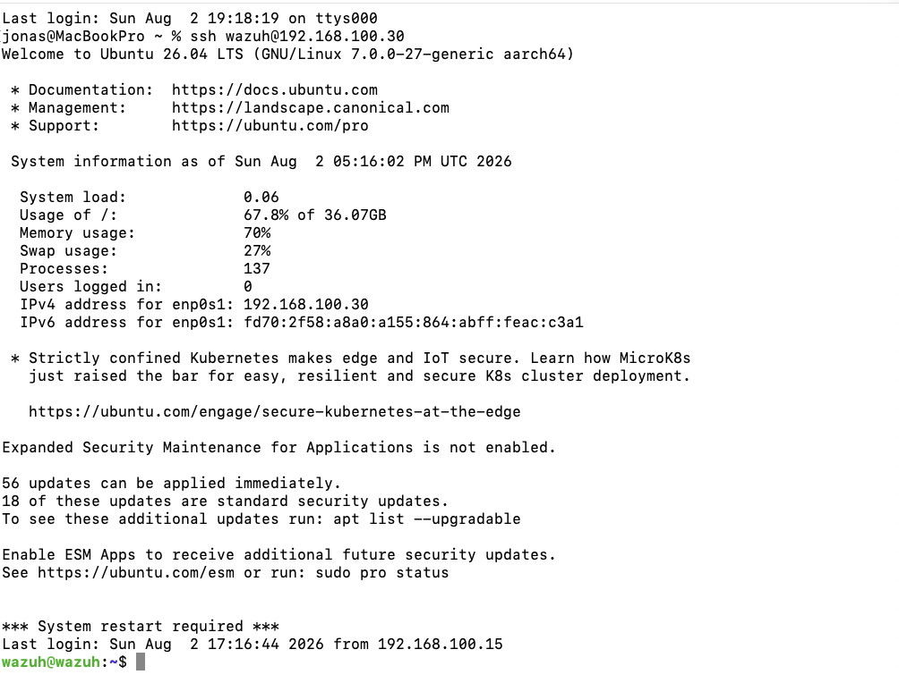

Forcing a password-only attempt now gets refused outright instead of prompting:

```bash
ssh -o PubkeyAuthentication=no wazuh@192.168.100.30
```

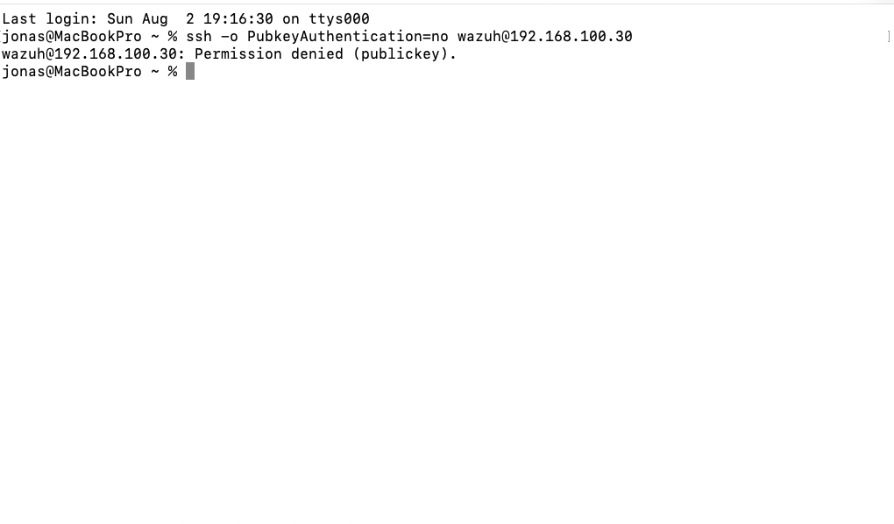

## Fail2ban

```bash
sudo apt install fail2ban
sudo systemctl enable --now fail2ban
```

Fail2ban ships with a default SSH jail, but I put my own settings in `jail.local` rather than
editing the packaged `jail.conf` directly, since that file gets overwritten on updates:

```bash
sudo nano /etc/fail2ban/jail.local
```

```
[sshd]
enabled = true
port = ssh
maxretry = 3
bantime = 3600
findtime = 600
```

Three failed attempts within 10 minutes bans the source IP for an hour.

```bash
sudo systemctl restart fail2ban
sudo fail2ban-client status sshd
```

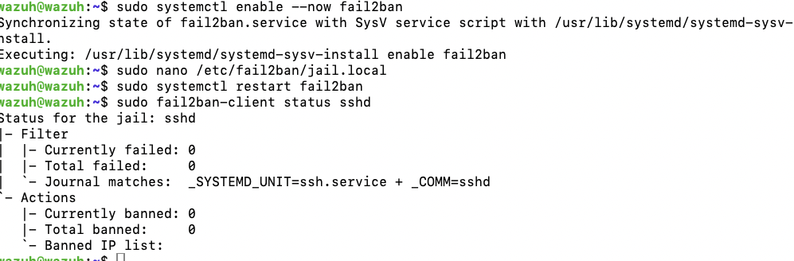

### Testing the ban

Since password login is already disabled, I couldn't trigger the ban with wrong passwords. Fail2ban
also picks up "invalid user" attempts though, so a few connections with made-up usernames did the
job just as well:

```bash
ssh fakeuser1@192.168.100.30
ssh fakeuser2@192.168.100.30
ssh fakeuser3@192.168.100.30
ssh fakeuser4@192.168.100.30
```

After a few of these, my own Mac's IP showed up as banned:

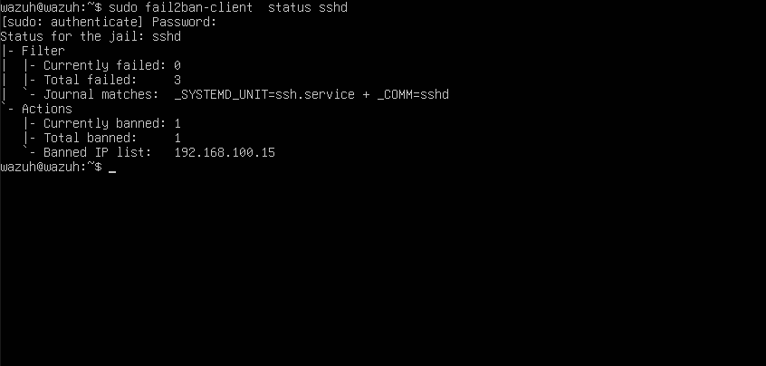

And at that point new SSH connections from that IP were refused outright — including my own, which
also knocked me out of my still-open session:

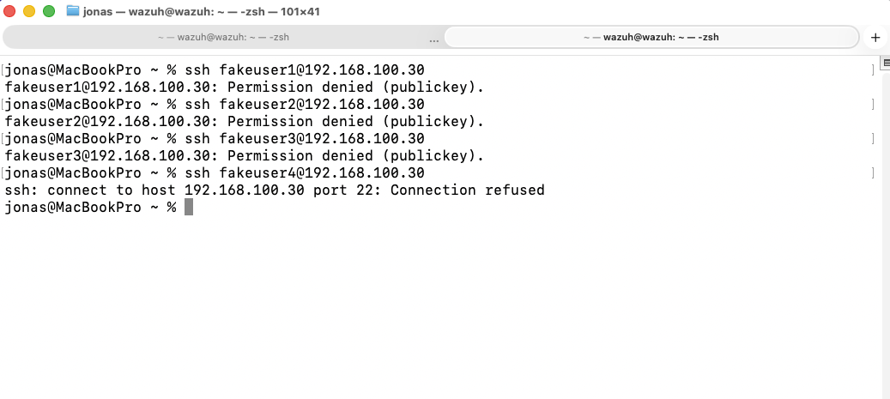

That's expected behavior, but it meant getting back in had to go through the UTM console directly
(not SSH), logging in locally on the VM, and removing the ban:

```bash
sudo fail2ban-client set sshd unbanip <my-mac-ip>
```

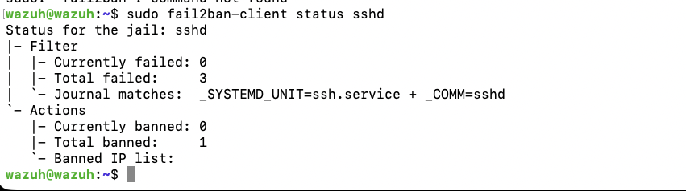

### A limitation worth knowing: banning is IP-based, not identity-based

Getting locked out raised an obvious question: could I have just gotten back in with a different IP
address instead of going through the UTM console? Yes — Fail2ban bans the source IP address (via an
iptables rule), not the device, the SSH key, or the user. If I'd given my Mac a second IP from the
same lab subnet, I could have reconnected immediately, completely unaffected by the ban.

That's a real limitation of IP-based banning in general, not just a lab quirk: it slows down a
single attacker with a fixed IP, but does very little against anything that can rotate source
addresses (a botnet, a VPN, or just someone requesting a new DHCP lease). Fail2ban is a delay
mechanism on top of the actual fix, not the fix itself — the real protection here is that password
authentication is off entirely, so even an attacker who avoids the ban has nothing to brute-force in
the first place.

## UFW firewall

First checked what was actually listening on the VM, to know what to allow:

```bash
sudo ss -tulpn
```

Externally reachable: SSH (22), Wazuh agent events (1514), agent registration (1515), and the
dashboard (443). The Wazuh API (55000) was also listening, but I'm not using it — only the
dashboard — so I left it closed rather than opening a port I don't need. The indexer (9200, 9300)
and DNS/chrony were already bound to `127.0.0.1` only, so they're unreachable from outside
regardless of firewall rules.

Default-deny incoming, and only the lab subnet (`192.168.100.0/24`) — not "anywhere" — gets access
to the ports actually in use:

```bash
sudo ufw default deny incoming
sudo ufw default allow outgoing

sudo ufw allow from 192.168.100.0/24 to any port 22 proto tcp comment 'SSH'
sudo ufw allow from 192.168.100.0/24 to any port 1514 proto tcp comment 'Wazuh agent events'
sudo ufw allow from 192.168.100.0/24 to any port 1515 proto tcp comment 'Wazuh agent registration'
sudo ufw allow from 192.168.100.0/24 to any port 443 proto tcp comment 'Wazuh dashboard'

sudo ufw enable
```

Same rule as with `sshd_config` earlier: test in a separate session before trusting it, since a
wrong UFW rule can lock you out just as easily as a bad SSH config.

```bash
sudo ufw status verbose
```

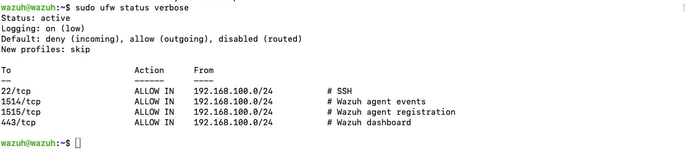

Confirmed SSH still worked and both agents (DC01, WS01) still showed as active in the dashboard
afterward — the firewall wasn't accidentally blocking the traffic it needed to allow.

## Turning off unnecessary services

```bash
systemctl list-units --type=service --state=running
```

Most of what's running is either needed by Wazuh itself (`wazuh-manager`, `wazuh-indexer`,
`wazuh-dashboard`, `filebeat`), or standard Ubuntu infrastructure (`ssh`, `cron`, `rsyslog`,
`systemd-*`, `dbus`). Three services stood out as leftovers from the default server install that a
VM without real hardware doesn't need:

- `ModemManager` — for mobile broadband hardware, which a VM doesn't have
- `multipathd` — for redundant storage paths on a SAN, not relevant here
- `udisks2` — automatic mounting of removable media, not needed on a headless server

I deliberately left `getty@tty1` and `serial-getty@ttyAMA0` running — those are what let me get
back into the VM through the UTM console when Fail2ban locked me out over SSH further down this
page, and losing that fallback access would be a bad trade for a marginal hardening gain.

```bash
sudo systemctl disable --now ModemManager.service
sudo systemctl disable --now multipathd.service
sudo systemctl disable --now udisks2.service

systemctl list-units --type=service --state=failed
```

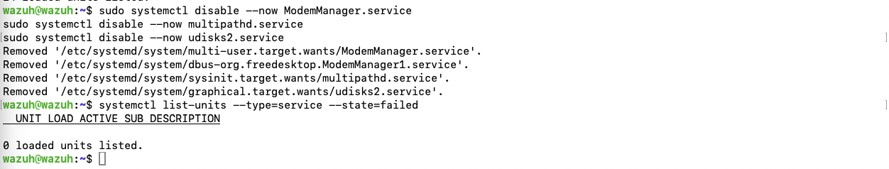

Empty output — nothing broke.

## Automatic security updates

`unattended-upgrades` turned out to already be installed and running by default on this Ubuntu
Server image, so this step was mostly about checking the configuration was actually doing the
right thing rather than setting it up from scratch:

```bash
cat /etc/apt/apt.conf.d/20auto-upgrades
cat /etc/apt/apt.conf.d/50unattended-upgrades
```

The allowed origins were already limited to `-security` (and the base release, which normally has
no new packages), and automatic reboots were off by default — which matters, since an unannounced
reboot in the middle of something would be its own kind of problem. I added a scheduled reboot
window instead of leaving it fully off, so a kernel security patch that needs a restart doesn't
just sit there indefinitely, but only happens at a predictable time:

```bash
sudo nano /etc/apt/apt.conf.d/50unattended-upgrades
```

```
Unattended-Upgrade::Remove-Unused-Kernel-Packages "true";
Unattended-Upgrade::Automatic-Reboot "true";
Unattended-Upgrade::Automatic-Reboot-Time "03:00";
```

Tested without actually changing anything:

```bash
sudo unattended-upgrade --dry-run --debug
```

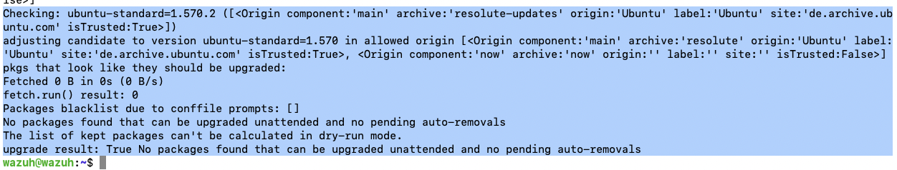

The dry-run also confirmed the filtering is working correctly: a regular (non-security)
`ubuntu-standard` update was available but explicitly skipped, since it wasn't coming from an
allowed security origin. Only real security patches get installed unattended — everything else
still needs a manual `apt upgrade`.

## Why this matters for SOC work

This is the same logic behind most real hardening baselines: remove the weakest authentication
method entirely rather than trying to make it stronger, and add a second control (Fail2ban) that
still works even if the first one is somehow bypassed later. Locking myself out with the Fail2ban
test was also a useful (if unplanned) lesson — it's exactly the kind of self-inflicted lockout that
makes out-of-band access (a console, IPMI, cloud provider's serial console) worth having before you
harden anything remotely.
