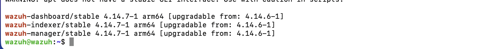
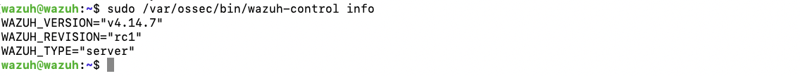
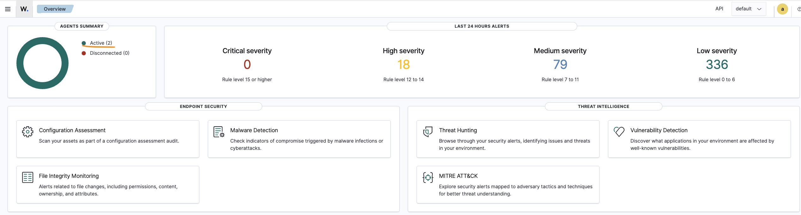

# Patch management — updating Wazuh from 4.14.6 to 4.14.7

I'd already decided to skip a full WSUS deployment for Windows patching (see
[`../PORTFOLIO_ROADMAP.md`](../PORTFOLIO_ROADMAP.md), item 1.6) — with only two Windows machines, it
wouldn't have proven much. But a real update became available for Wazuh itself while I was working on
the lab, so I used that as the patch-management exercise instead: a real update on a service that's
actually running, not a symbolic one.

## Backup first

Before touching anything, I shut the Wazuh VM down and made a full clone of it in UTM (right-click the
VM in the library → Duplicate). UTM doesn't support live snapshots the way some other hypervisors do,
so a full clone was the practical equivalent — if the update had gone wrong, I could just boot the old
copy again.

I also backed up the indexer's own security configuration, since that's what the official Wazuh
upgrade guide recommends doing before any upgrade:

```bash
sudo /usr/share/wazuh-indexer/bin/indexer-security-init.sh --options "-backup /etc/wazuh-indexer/opensearch-security -icl -nhnv"
```

## Checking what was actually available

```bash
sudo /var/ossec/bin/wazuh-control info
# WAZUH_VERSION="v4.14.6"

sudo apt-get update
apt list --upgradable | grep wazuh
```



4.14.6 to 4.14.7 is a patch release, not a major version jump, so the risk here was lower than a big
upgrade would be — no index-format changes to worry about, same overall architecture. The order still
matters though: indexer first, then the server, then the dashboard.

## The upgrade

Stopped the dashboard service (the indexer and manager stay reachable during their own upgrade steps):

```bash
sudo systemctl stop wazuh-dashboard
```

Upgraded the indexer first, then checked the cluster was healthy before touching anything else:

```bash
sudo apt-get install wazuh-indexer
curl -k -u admin:<indexer-admin-password> https://localhost:9200/_cluster/health?pretty
```

```
"status" : "green",
"active_primary_shards" : 38,
"active_shards" : 38,
"unassigned_shards" : 0,
```

Green, all 38 shards active, nothing unassigned — safe to continue.

Then the server:

```bash
sudo apt-get install wazuh-manager
sudo systemctl restart wazuh-manager
```

Then the dashboard:

```bash
sudo apt-get install wazuh-dashboard
sudo systemctl start wazuh-dashboard
```

## Verifying it worked

```bash
sudo /var/ossec/bin/wazuh-control info
```



And, just as important: checked that the update didn't break the agent connections, since that's the
whole point of running this SIEM in the first place.



## Why this matters for SOC work

Patch management isn't just "click update" — it's knowing the correct order for a multi-component
system, having a rollback plan before you start, and verifying the thing still actually works
afterward instead of assuming it does. A SIEM going down or silently losing agent connections during
an update is its own kind of incident, so treating this update with the same care as a production
change (backup, staged upgrade order, health check between steps, post-upgrade verification) was the
actual point of doing it this way instead of just running one script and hoping.
